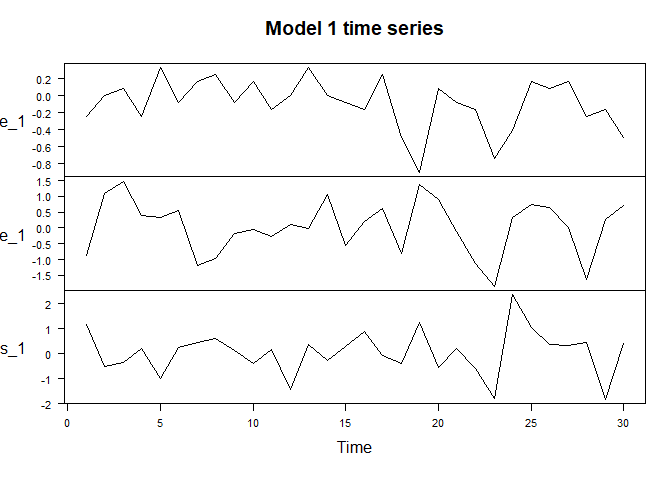
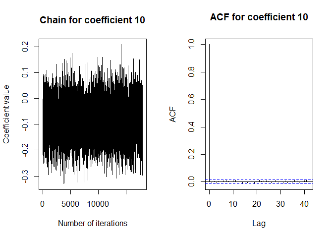
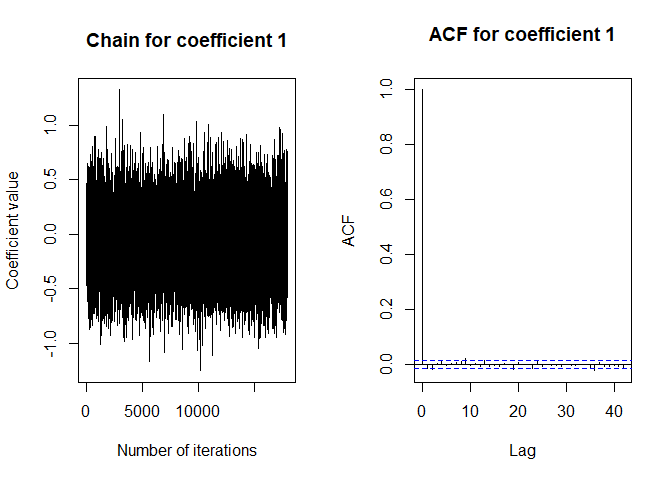
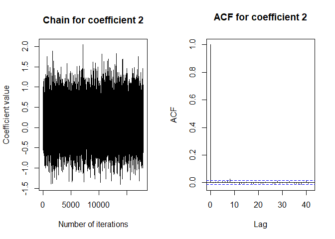
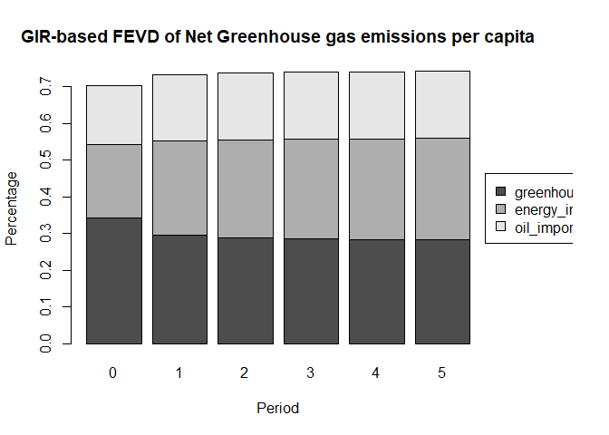

## Data Preprocessing


```r
#Libraries
library(tidyverse)
```

```
## ── Attaching packages ─────────────────────────────────────── tidyverse 1.3.2 ──
## ✔ ggplot2 3.4.0      ✔ purrr   1.0.0 
## ✔ tibble  3.1.8      ✔ dplyr   1.0.10
## ✔ tidyr   1.2.1      ✔ stringr 1.5.0 
## ✔ readr   2.1.3      ✔ forcats 0.5.2 
## ── Conflicts ────────────────────────────────────────── tidyverse_conflicts() ──
## ✖ dplyr::filter() masks stats::filter()
## ✖ dplyr::lag()    masks stats::lag()
```

```r
library(readxl)
library(xts)
```

```
## Warning: package 'xts' was built under R version 4.2.3
```

```
## Loading required package: zoo
```

```
## Warning: package 'zoo' was built under R version 4.2.3
```

```
## 
## Attaching package: 'zoo'
## 
## The following objects are masked from 'package:base':
## 
##     as.Date, as.Date.numeric
## 
## 
## ################################### WARNING ###################################
## # We noticed you have dplyr installed. The dplyr lag() function breaks how    #
## # base R's lag() function is supposed to work, which breaks lag(my_xts).      #
## #                                                                             #
## # Calls to lag(my_xts) that you enter or source() into this session won't     #
## # work correctly.                                                             #
## #                                                                             #
## # All package code is unaffected because it is protected by the R namespace   #
## # mechanism.                                                                  #
## #                                                                             #
## # Set `options(xts.warn_dplyr_breaks_lag = FALSE)` to suppress this warning.  #
## #                                                                             #
## # You can use stats::lag() to make sure you're not using dplyr::lag(), or you #
## # can add conflictRules('dplyr', exclude = 'lag') to your .Rprofile to stop   #
## # dplyr from breaking base R's lag() function.                                #
## ################################### WARNING ###################################
## 
## Attaching package: 'xts'
## 
## The following objects are masked from 'package:dplyr':
## 
##     first, last
```

```r
library(dplyr)
library(imputeTS)
```

```
## Warning: package 'imputeTS' was built under R version 4.2.3
```

```
## Registered S3 method overwritten by 'quantmod':
##   method            from
##   as.zoo.data.frame zoo 
## 
## Attaching package: 'imputeTS'
## 
## The following object is masked from 'package:zoo':
## 
##     na.locf
```

```r
library(ggplot2)
library(MTS)
```

```
## Warning: package 'MTS' was built under R version 4.2.3
```

```r
library(tseries)
```

```
## Warning: package 'tseries' was built under R version 4.2.3
```

```
## 
## Attaching package: 'tseries'
## 
## The following object is masked from 'package:imputeTS':
## 
##     na.remove
```

```r
library(vars)
```

```
## Warning: package 'vars' was built under R version 4.2.3
```

```
## Loading required package: MASS
## 
## Attaching package: 'MASS'
## 
## The following object is masked from 'package:dplyr':
## 
##     select
## 
## Loading required package: strucchange
```

```
## Warning: package 'strucchange' was built under R version 4.2.3
```

```
## Loading required package: sandwich
```

```
## Warning: package 'sandwich' was built under R version 4.2.3
```

```
## 
## Attaching package: 'strucchange'
## 
## The following object is masked from 'package:stringr':
## 
##     boundary
## 
## Loading required package: urca
```

```
## Warning: package 'urca' was built under R version 4.2.3
```

```
## Loading required package: lmtest
## 
## Attaching package: 'vars'
## 
## The following object is masked from 'package:MTS':
## 
##     VAR
```

```r
library(bvartools)
```

```
## Warning: package 'bvartools' was built under R version 4.2.3
```

```
## Loading required package: coda
```

```
## Warning: package 'coda' was built under R version 4.2.3
```

```
## 
## Attaching package: 'bvartools'
## 
## The following objects are masked from 'package:vars':
## 
##     fevd, irf
```

```r
data <- read_excel("data.xlsx", sheet = 'Data')
```


```r
data$Rail_tracks_KM <- na_interpolation(data$Rail_tracks_KM, option = 'spline')
data$Total_freight_loaded_and_unloaded <- na_interpolation(data$Total_freight_loaded_and_unloaded, option = 'spline')
data$Chicken_heads <- na_interpolation(data$Chicken_heads, option = 'spline')
data$Turkeys_heads <- na_interpolation(data$Turkeys_heads, option = 'spline')
```


```r
data <- data %>% 
  mutate(livestock_heads = Pigs_heads + Head_sheep + Head_goat + 
           Chicken_heads + Turkeys_heads + Cattle_heads + Buffalo_head) 

data <- data %>% 
  mutate(res_capacity = hydro_capacity + geothermal_capacity + 
           wind_capacity + solar_capacity + biofuels_capacity + 
           biogas_capacity + waste_capacity)

data <- data %>% dplyr::select(Year, net_greenhouse_pc, environmental_taxes, `GDP pc`,
                                 industrial_production, energy_imp_dep, naturalgas_imports,
                                 oil_imports, total_energy_supply, gross_electricity_production,
                                 res_capacity, livestock_heads,
                                 Share_of_land_under_permanent_crops, Area_harvested_Rice,
                                 Fertilizer_used_per_area_of_cropland, Share_in_land_area_Forest_Land,
                                 Rail_tracks_KM, Length_of_motorways, Number_of_motorcycle, Total_freight_loaded_and_unloaded)
```


```r
data <- apply(data, MARGIN = 2, FUN = scale)
data <- data.frame(data)
```


```r
par(mfrow = c(2,2))
plot(data$net_greenhouse_pc,
     type = 'l',
     xlab = "Time",
     ylab = "TON per capita - Scaled",
     main = "Net greenhouse gases emissions")

plot(data$environmental_taxes,
     type = 'l',
     xlab = "Time",
     ylab = "% of GDP - Scaled",
     main = "Environmental taxes")

plot(data$GDP.pc,
     type = 'l',
     xlab = "Time",
     ylab = "Constant 2010 US dollars - Scaled",
     main = "GDP per capita")

plot(data$industrial_production,
     type = 'l',
     xlab = "Time",
     ylab = "Index 2015=100 - Scaled",
     main = "Industrial production")
```

<!-- -->


```r
par(mfrow = c(2,2))
plot(data$energy_imp_dep,
     type = 'l',
     xlab = "Time",
     ylab = "% - Scaled",
     main = "Energy imports dependency")

plot(data$naturalgas_imports,
     type = 'l',
     xlab = "Time",
     ylab = "Million m^3 - Scaled",
     main = "Natural gas imports")

plot(data$oil_imports,
     type = 'l',
     xlab = "Time",
     ylab = "Thousand tonnes - Scaled",
     main = "Oil imports")

plot(data$total_energy_supply,
     type = 'l',
     xlab = "Time",
     ylab = "Gigawatt-hour - Scaled",
     main = "Total energy supply")
```

<!-- -->


```r
par(mfrow = c(2,2))
plot(data$gross_electricity_production,
     type = 'l',
     xlab = "Time",
     ylab = "Gigawatt-hour - Scaled - Scaled",
     main = "Gross electricity production")

plot(data$res_capacity,
     type = 'l',
     xlab = "Time",
     ylab = "Megawatt - Scaled",
     main = "Renewable Energy capacity")

plot(data$livestock_heads,
     type = 'l',
     xlab = "Time",
     ylab = "Thousand heads - Scaled",
     main = "Livestock heads")

plot(data$Share_of_land_under_permanent_crops,
     type = 'l',
     xlab = "Time",
     ylab = "% - Scaled",
     main = "Share of land under permanent crops")
```

<!-- -->


```r
par(mfrow = c(2,2))
plot(data$Area_harvested_Rice,
     type = 'l',
     xlab = "Time",
     ylab = "Area ha - Scaled",
     main = "Harvested rice")

plot(data$Fertilizer_used_per_area_of_cropland,
     type = 'l',
     xlab = "Time",
     ylab = "kg per ha - Scaled",
     main = "Fertilizer used per ha of cropland")

plot(data$Share_in_land_area_Forest_Land,
     type = 'l',
     xlab = "Time",
     ylab = "% - Scaled",
     main = "Share of forest land in total land")

plot(data$Rail_tracks_KM,
     type = 'l',
     xlab = "Time",
     ylab = "km - Scaled",
     main = "Rail tracks")
```

<!-- -->


```r
par(mfrow = c(1,3))
plot(data$Length_of_motorways,
     type = 'l',
     xlab = "Time",
     ylab = "km - Scaled",
     main = "Length of motorways")

plot(data$Number_of_motorcycle,
     type = 'l',
     xlab = "Time",
     ylab = "Units - Scaled",
     main = "Number of motorcycles")

plot(data$Total_freight_loaded_and_unloaded,
     type = 'l',
     xlab = "Time",
     ylab = "TON - Scaled",
     main = "Total aerial freight")
```

<!-- -->


```r
greenhouse_1 <- diff(data$net_greenhouse_pc, differences = 1)
env_tax_1 <- diff(data$environmental_taxes, differences = 1)
GDP_pc_1 <- diff(data$GDP.pc, differences = 1)
ind_prod_1 <- diff(data$industrial_production, differences = 1)
energy_imp_dep_1 <- diff(data$energy_imp_dep, differences = 1)
naturalgas_imports_1  <- diff(data$naturalgas_imports , differences = 1)
oil_imports_1  <- diff(data$oil_imports , differences = 1)
energy_supply_1 <- diff(data$total_energy_supply , differences = 1)
electricity_prod_1 <- diff(data$gross_electricity_production, differences = 1)
res_capacity_1  <- diff(data$res_capacity  , differences = 1)
livestock_heads_1 <- diff(data$livestock_heads , differences = 1)
permanent_crops_1 <- diff(data$Share_of_land_under_permanent_crops , differences = 1)
harvested_rice_1 <- diff(data$Area_harvested_Rice, differences = 1)
fertilizer_1 <- diff(data$Fertilizer_used_per_area_of_cropland, differences = 1)
forest_land_1 <- diff(data$Share_in_land_area_Forest_Land, differences = 1)
rail_tracks_1 <- diff(data$Rail_tracks_KM , differences = 1)
motorways_len_1 <- diff(data$Length_of_motorways , differences = 1)
motorcycles_1 <- diff(data$Number_of_motorcycle , differences = 1)
aerial_freight_1 <- diff(data$Total_freight_loaded_and_unloaded , differences = 1)
```


```r
bayes_1 <- cbind(greenhouse_1, harvested_rice_1, permanent_crops_1)
bayes_2 <- cbind(greenhouse_1, energy_imp_dep_1, oil_imports_1)
bayes_3 <- cbind(greenhouse_1, GDP_pc_1, fertilizer_1)
```

## Model 1

Model 1 includes: net greenhouse gas emission per capita, area of harvester rice, and share of land under permanent crops


```r
bayes <- bayes_1
head(bayes)
```

```
##      greenhouse_1 harvested_rice_1 permanent_crops_1
## [1,]  -0.24713412       -0.8858458         1.1820050
## [2,]   0.00000000        1.1076954        -0.5319023
## [3,]   0.08237804        1.4877318        -0.3398264
## [4,]  -0.24713412        0.4086653         0.1920758
## [5,]   0.32951216        0.3210317        -0.9899292
## [6,]  -0.08237804        0.5571473         0.2511761
```

```r
bayes_ts <- as.ts(bayes)
plot(bayes_ts, main = "Model 1 time series", las = 1.5)
```

<!-- -->

```r
summary(bayes_ts)
```

```
##   greenhouse_1      harvested_rice_1   permanent_crops_1 
##  Min.   :-0.90616   Min.   :-1.84710   Min.   :-1.84688  
##  1st Qu.:-0.22654   1st Qu.:-0.48152   1st Qu.:-0.41001  
##  Median :-0.08238   Median : 0.15120   Median : 0.19946  
##  Mean   :-0.09062   Mean   : 0.04269   Mean   : 0.05368  
##  3rd Qu.: 0.14416   3rd Qu.: 0.65092   3rd Qu.: 0.43217  
##  Max.   : 0.32951   Max.   : 1.48773   Max.   : 2.36401
```

## Model selection


```r
VARselect(bayes_ts, lag.max = 4,type = "const") 
```

```
## $selection
## AIC(n)  HQ(n)  SC(n) FPE(n) 
##      1      1      1      1 
## 
## $criteria
##                  1          2          3           4
## AIC(n) -2.63631094 -2.0678125 -1.5633068 -1.93325579
## HQ(n)  -2.46910188 -1.7751967 -1.1452841 -1.38982637
## SC(n)  -2.05565100 -1.0516576 -0.1116569 -0.04611099
## FPE(n)  0.07215613  0.1317313  0.2373526  0.19448137
```

```r
bmodel <- gen_var(bayes_ts, p = 1, deterministic = "const")
y <- t(bmodel$data$Y)
x <- t(bmodel$data$Z)
```

# OLS estimation


```r
beta_ols <- tcrossprod(y, x) %*% solve(tcrossprod(x)) # Calculate estimates
round(beta_ols, 3) # Round estimates and print
```

```
##                   greenhouse_1.01 harvested_rice_1.01 permanent_crops_1.01
## greenhouse_1                0.136               0.084                0.135
## harvested_rice_1           -0.987               0.209                0.036
## permanent_crops_1          -0.382               0.026               -0.203
##                    const
## greenhouse_1      -0.082
## harvested_rice_1  -0.007
## permanent_crops_1 -0.007
```

```r
mu_ols <- y - beta_ols %*% x
mu_sigma_ols <- tcrossprod(mu_ols) / (ncol(y) - nrow(x))
round(mu_sigma_ols, 2)
```

```
##                   greenhouse_1 harvested_rice_1 permanent_crops_1
## greenhouse_1              0.07             0.03              0.00
## harvested_rice_1          0.03             0.71              0.12
## permanent_crops_1         0.00             0.12              0.82
```

# Bayesian estimation


```r
set.seed(1234567)
iter <- 20000 # Number of iterations of the Gibbs sampler
burnin <- 2000 # Number of burn-in draws
store <- iter - burnin

t <- ncol(y) # Number of observations
k <- nrow(y) # Number of endogenous variables
m <- k * nrow(x) # Number of estimated coefficients
```


```r
a_mu_prior <- matrix(0, m) # Vector of prior parameter means
a_v_i_prior <- diag(1, m) # Inverse of the prior covariance matrix

u_sigma_df_prior <- 2*k # Prior degrees of freedom
u_sigma_scale_prior <- diag(1, k) # Prior covariance matrix
u_sigma_df_post <- t + u_sigma_df_prior # Posterior degrees of freedom
```


```r
u_sigma_i <- solve(mu_sigma_ols)

# Data containers for Gibss sampler
draws_a <- matrix(NA, m, store)
draws_sigma <- matrix(NA, k * k, store)
```


```r
for (draw in 1:iter) {
  # Draw conditional mean parameters
  a <- post_normal(y, x, u_sigma_i, a_mu_prior, a_v_i_prior)
  
  # Draw variance-covariance matrix
  u <- y - matrix(a, k) %*% x # Obtain residuals
  u_sigma_scale_post <- solve(u_sigma_scale_prior + tcrossprod(u))
  u_sigma_i <- matrix(rWishart(1, u_sigma_df_post, u_sigma_scale_post)[,, 1], k)
  u_sigma <- solve(u_sigma_i) # Invert Sigma_i to obtain Sigma
  
  # Store draws
  if (draw > burnin) {
    draws_a[, draw - burnin] <- a
    draws_sigma[, draw - burnin] <- u_sigma
  }
}
```


```r
A <- rowMeans(draws_a) # Obtain means for every row
A <- matrix(A, k) # Transform mean vector into a matrix
A <- round(A, 3) # Round values
dimnames(A) <- list(dimnames(y)[[1]], dimnames(x)[[1]]) # Rename matrix dimensions

A # Print
```

```
##                   greenhouse_1.01 harvested_rice_1.01 permanent_crops_1.01
## greenhouse_1                0.138               0.083                0.136
## harvested_rice_1           -0.760               0.189                0.045
## permanent_crops_1          -0.260               0.014               -0.192
##                    const
## greenhouse_1      -0.081
## harvested_rice_1   0.008
## permanent_crops_1  0.000
```

```r
Sigma <- rowMeans(draws_sigma) # Obtain means for every row
Sigma <- matrix(Sigma, k) # Transform mean vector into a matrix
Sigma <- round(Sigma, 2) # Round values
dimnames(Sigma) <- list(dimnames(y)[[1]], dimnames(y)[[1]]) # Rename matrix dimensions

Sigma # Print
```

```
##                   greenhouse_1 harvested_rice_1 permanent_crops_1
## greenhouse_1              0.11             0.02              0.00
## harvested_rice_1          0.02             0.69              0.11
## permanent_crops_1         0.00             0.11              0.79
```


```r
bvar_model <- bvar(y = bmodel$data$Y, x = bmodel$data$Z, A = draws_a[1:9,],
                 C = draws_a[10:12, ], Sigma = draws_sigma)
#bvar_model <- thin.bvar(bvar_model, thin = 2)
summary(bvar_model)
```

```
## 
## Bayesian VAR model with p = 1 
## 
## Model:
## 
## y ~ greenhouse_1.01 + harvested_rice_1.01 + permanent_crops_1.01 + const
## 
## Variable: greenhouse_1 
## 
##                          Mean      SD  Naive SD Time-series SD     2.5%
## greenhouse_1.01       0.13800 0.20865 0.0015552      0.0015552 -0.27856
## harvested_rice_1.01   0.08286 0.07178 0.0005350      0.0005350 -0.05928
## permanent_crops_1.01  0.13550 0.06775 0.0005050      0.0005050  0.00402
## const                -0.08124 0.06216 0.0004633      0.0004633 -0.20355
##                           50%   97.5%
## greenhouse_1.01       0.13982 0.54812
## harvested_rice_1.01   0.08277 0.22266
## permanent_crops_1.01  0.13574 0.27031
## const                -0.08120 0.04131
## 
## Variable: harvested_rice_1 
## 
##                           Mean     SD Naive SD Time-series SD    2.5%       50%
## greenhouse_1.01      -0.759637 0.4765 0.003552       0.003552 -1.6900 -0.766335
## harvested_rice_1.01   0.189438 0.1820 0.001357       0.001357 -0.1667  0.189812
## permanent_crops_1.01  0.045016 0.1704 0.001270       0.001270 -0.2863  0.045105
## const                 0.007861 0.1559 0.001162       0.001162 -0.2976  0.005634
##                       97.5%
## greenhouse_1.01      0.1883
## harvested_rice_1.01  0.5501
## permanent_crops_1.01 0.3817
## const                0.3218
## 
## Variable: permanent_crops_1 
## 
##                            Mean     SD Naive SD Time-series SD    2.5%
## greenhouse_1.01      -2.598e-01 0.5046 0.003761       0.003761 -1.2471
## harvested_rice_1.01   1.401e-02 0.1939 0.001445       0.001445 -0.3685
## permanent_crops_1.01 -1.923e-01 0.1848 0.001378       0.001378 -0.5530
## const                -1.987e-05 0.1670 0.001245       0.001245 -0.3314
##                            50%  97.5%
## greenhouse_1.01      -0.260843 0.7355
## harvested_rice_1.01   0.014088 0.3962
## permanent_crops_1.01 -0.191455 0.1727
## const                -0.000205 0.3331
## 
## Variance-covariance matrix:
## 
##                                         Mean      SD  Naive SD Time-series SD
## greenhouse_1_greenhouse_1           0.105865 0.03017 0.0002249      0.0002530
## greenhouse_1_harvested_rice_1       0.022639 0.05267 0.0003926      0.0004438
## greenhouse_1_permanent_crops_1      0.003964 0.05668 0.0004225      0.0004735
## harvested_rice_1_greenhouse_1       0.022639 0.05267 0.0003926      0.0004438
## harvested_rice_1_harvested_rice_1   0.690775 0.19062 0.0014208      0.0015776
## harvested_rice_1_permanent_crops_1  0.110765 0.14364 0.0010706      0.0011950
## permanent_crops_1_greenhouse_1      0.003964 0.05668 0.0004225      0.0004735
## permanent_crops_1_harvested_rice_1  0.110765 0.14364 0.0010706      0.0011950
## permanent_crops_1_permanent_crops_1 0.790323 0.22095 0.0016469      0.0019375
##                                         2.5%      50%  97.5%
## greenhouse_1_greenhouse_1            0.06273 0.100813 0.1782
## greenhouse_1_harvested_rice_1       -0.07826 0.020905 0.1306
## greenhouse_1_permanent_crops_1      -0.10883 0.003984 0.1166
## harvested_rice_1_greenhouse_1       -0.07826 0.020905 0.1306
## harvested_rice_1_harvested_rice_1    0.41010 0.660749 1.1397
## harvested_rice_1_permanent_crops_1  -0.15338 0.102057 0.4220
## permanent_crops_1_greenhouse_1      -0.10883 0.003984 0.1166
## permanent_crops_1_harvested_rice_1  -0.15338 0.102057 0.4220
## permanent_crops_1_permanent_crops_1  0.46581 0.753218 1.3177
```


```r
str(draws_a)
```

```
##  num [1:12, 1:18000] 0.1377 -0.9716 -0.0626 0.1195 0.1873 ...
```

```r
for (i in 1:nrow(draws_a)){
  par(mfrow = c(1, 2))
  ts.plot(draws_a[i,], 
          xlab = 'Number of iterations', 
          ylab = "Coefficient value", 
          main = paste0("Chain for coefficient ", i))
  acf(draws_a[i,], main = paste0("ACF for coefficient ", i))
}
```

<!-- --><!-- --><!-- --><!-- --><!-- --><!-- --><!-- --><!-- --><!-- --><!-- --><!-- --><!-- -->

```r
plot(bvar_model)
```

<!-- -->


```r
GIR_1 <- bvartools::irf(bvar_model, impulse = "harvested_rice_1", response = "greenhouse_1", n.ahead = 5, type = "gir")
round(GIR_1, 2)
```

```
## Time Series:
## Start = 0 
## End = 5 
## Frequency = 1 
##    2.5%  50% 97.5%
## 0 -0.11 0.03  0.17
## 1 -0.04 0.11  0.27
## 2 -0.07 0.02  0.14
## 3 -0.06 0.00  0.07
## 4 -0.04 0.00  0.03
## 5 -0.02 0.00  0.02
```

```r
plot(GIR_1, main = "GIRF, Impulse = harvested_rice, Response = greenhouse gas", xlab = "Periods ahead", ylab = "Response")
```

<!-- -->

```r
GIR_2 <- bvartools::irf(bvar_model, impulse = "permanent_crops_1", response = "greenhouse_1", n.ahead = 5, type = "gir")
round(GIR_2, 2)
```

```
## Time Series:
## Start = 0 
## End = 5 
## Frequency = 1 
##    2.5%  50% 97.5%
## 0 -0.13 0.01  0.14
## 1  0.01 0.15  0.29
## 2 -0.10 0.00  0.11
## 3 -0.06 0.00  0.07
## 4 -0.04 0.00  0.03
## 5 -0.01 0.00  0.03
```

```r
plot(GIR_2, main = "GIRF, Impulse = permanent_crops, Response = greenhouse gas", xlab = "Periods ahead", ylab = "Response")
```

<!-- -->


```r
bvar_fevd_gir <- bvartools::fevd(bvar_model, response = "greenhouse_1", type = "gir")
plot(bvar_fevd_gir, main = "GIR-based FEVD of Net Greenhouse gas emissions per capita")
```

<!-- -->

## Model 2

Model 2 includes: net greenhouse gas emission per capita, energy import dependency, and oil imports


```r
bayes <- bayes_2
head(bayes)
```

```
##      greenhouse_1 energy_imp_dep_1 oil_imports_1
## [1,]  -0.24713412      -0.76056690   -0.26076304
## [2,]   0.00000000       0.65069367    0.42766551
## [3,]   0.08237804      -1.09354382   -0.09012027
## [4,]  -0.24713412       0.09644428   -0.13062852
## [5,]   0.32951216       0.38241987   -0.13140481
## [6,]  -0.08237804      -0.02289026    0.07177159
```

```r
bayes_ts <- as.ts(bayes)
plot(bayes_ts, main = "Model 2 time series", las = 1.5)
```

<!-- -->

```r
summary(bayes_ts)
```

```
##   greenhouse_1      energy_imp_dep_1  oil_imports_1     
##  Min.   :-0.90616   Min.   :-1.2300   Min.   :-1.05761  
##  1st Qu.:-0.22654   1st Qu.:-0.6683   1st Qu.:-0.30411  
##  Median :-0.08238   Median :-0.1280   Median :-0.07632  
##  Mean   :-0.09062   Mean   :-0.1114   Mean   :-0.10462  
##  3rd Qu.: 0.14416   3rd Qu.: 0.3665   3rd Qu.: 0.07876  
##  Max.   : 0.32951   Max.   : 1.0884   Max.   : 0.65244
```

## Model selection


```r
VARselect(bayes_ts, lag.max = 4,type = "const") 
```

```
## $selection
## AIC(n)  HQ(n)  SC(n) FPE(n) 
##      1      1      1      1 
## 
## $criteria
##                   1            2            3            4
## AIC(n) -6.442610257 -5.923799618 -5.682105167 -5.518600348
## HQ(n)  -6.275401204 -5.631183775 -5.264082534 -4.975170925
## SC(n)  -5.861950316 -4.907644722 -4.230455315 -3.631455541
## FPE(n)  0.001604052  0.002786473  0.003860314  0.005392407
```

```r
bmodel <- gen_var(bayes_ts, p = 1, deterministic = "const")
y <- t(bmodel$data$Y)
x <- t(bmodel$data$Z)
```

# OLS estimation


```r
beta_ols <- tcrossprod(y, x) %*% solve(tcrossprod(x)) # Calculate estimates
round(beta_ols, 3) # Round estimates and print
```

```
##                  greenhouse_1.01 energy_imp_dep_1.01 oil_imports_1.01  const
## greenhouse_1              -0.060               0.120            0.194 -0.067
## energy_imp_dep_1           0.143              -0.511           -0.022 -0.117
## oil_imports_1              0.008              -0.023           -0.045 -0.103
```

```r
mu_ols <- y - beta_ols %*% x
mu_sigma_ols <- tcrossprod(mu_ols) / (ncol(y) - nrow(x))
round(mu_sigma_ols, 2)
```

```
##                  greenhouse_1 energy_imp_dep_1 oil_imports_1
## greenhouse_1             0.09             0.09          0.09
## energy_imp_dep_1         0.09             0.33          0.12
## oil_imports_1            0.09             0.12          0.13
```

# Bayesian estimation


```r
set.seed(1234567)
iter <- 20000 # Number of iterations of the Gibbs sampler
burnin <- 2000 # Number of burn-in draws
store <- iter - burnin

t <- ncol(y) # Number of observations
k <- nrow(y) # Number of endogenous variables
m <- k * nrow(x) # Number of estimated coefficients
```


```r
a_mu_prior <- matrix(0, m) # Vector of prior parameter means
a_v_i_prior <- diag(1, m) # Inverse of the prior covariance matrix

u_sigma_df_prior <- 2*k # Prior degrees of freedom
u_sigma_scale_prior <- diag(1, k) # Prior covariance matrix
u_sigma_df_post <- t + u_sigma_df_prior # Posterior degrees of freedom
```


```r
u_sigma_i <- solve(mu_sigma_ols)

# Data containers for Gibss sampler
draws_a <- matrix(NA, m, store)
draws_sigma <- matrix(NA, k * k, store)
```


```r
for (draw in 1:iter) {
  # Draw conditional mean parameters
  a <- post_normal(y, x, u_sigma_i, a_mu_prior, a_v_i_prior)
  
  # Draw variance-covariance matrix
  u <- y - matrix(a, k) %*% x # Obtain residuals
  u_sigma_scale_post <- solve(u_sigma_scale_prior + tcrossprod(u))
  u_sigma_i <- matrix(rWishart(1, u_sigma_df_post, u_sigma_scale_post)[,, 1], k)
  u_sigma <- solve(u_sigma_i) # Invert Sigma_i to obtain Sigma
  
  # Store draws
  if (draw > burnin) {
    draws_a[, draw - burnin] <- a
    draws_sigma[, draw - burnin] <- u_sigma
  }
}
```


```r
A <- rowMeans(draws_a) # Obtain means for every row
A <- matrix(A, k) # Transform mean vector into a matrix
A <- round(A, 3) # Round values
dimnames(A) <- list(dimnames(y)[[1]], dimnames(x)[[1]]) # Rename matrix dimensions

A # Print
```

```
##                  greenhouse_1.01 energy_imp_dep_1.01 oil_imports_1.01  const
## greenhouse_1              -0.054               0.125            0.180 -0.067
## energy_imp_dep_1           0.113              -0.491           -0.018 -0.117
## oil_imports_1              0.003              -0.018           -0.047 -0.104
```

```r
Sigma <- rowMeans(draws_sigma) # Obtain means for every row
Sigma <- matrix(Sigma, k) # Transform mean vector into a matrix
Sigma <- round(Sigma, 2) # Round values
dimnames(Sigma) <- list(dimnames(y)[[1]], dimnames(y)[[1]]) # Rename matrix dimensions

Sigma # Print
```

```
##                  greenhouse_1 energy_imp_dep_1 oil_imports_1
## greenhouse_1             0.12             0.08          0.08
## energy_imp_dep_1         0.08             0.33          0.11
## oil_imports_1            0.08             0.11          0.16
```


```r
bvar_model <- bvar(y = bmodel$data$Y, x = bmodel$data$Z, A = draws_a[1:9,],
                 C = draws_a[10:12, ], Sigma = draws_sigma)
#bvar_model <- thin.bvar(bvar_model, thin = 2)
summary(bvar_model)
```

```
## 
## Bayesian VAR model with p = 1 
## 
## Model:
## 
## y ~ greenhouse_1.01 + energy_imp_dep_1.01 + oil_imports_1.01 + const
## 
## Variable: greenhouse_1 
## 
##                         Mean      SD  Naive SD Time-series SD    2.5%      50%
## greenhouse_1.01     -0.05360 0.28652 0.0021356      0.0021948 -0.6237 -0.05467
## energy_imp_dep_1.01  0.12471 0.11927 0.0008890      0.0008743 -0.1094  0.12451
## oil_imports_1.01     0.18042 0.30494 0.0022729      0.0022729 -0.4147  0.17660
## const               -0.06654 0.06572 0.0004899      0.0004899 -0.1958 -0.06693
##                       97.5%
## greenhouse_1.01     0.51191
## energy_imp_dep_1.01 0.36159
## oil_imports_1.01    0.78449
## const               0.06488
## 
## Variable: energy_imp_dep_1 
## 
##                        Mean     SD  Naive SD Time-series SD    2.5%      50%
## greenhouse_1.01      0.1130 0.4393 0.0032746      0.0034852 -0.7469  0.11653
## energy_imp_dep_1.01 -0.4911 0.1987 0.0014811      0.0014811 -0.8772 -0.49175
## oil_imports_1.01    -0.0181 0.4657 0.0034708      0.0034708 -0.9303 -0.01907
## const               -0.1175 0.1094 0.0008153      0.0008153 -0.3317 -0.11889
##                        97.5%
## greenhouse_1.01      0.97849
## energy_imp_dep_1.01 -0.09756
## oil_imports_1.01     0.89352
## const                0.10118
## 
## Variable: oil_imports_1 
## 
##                          Mean      SD  Naive SD Time-series SD    2.5%
## greenhouse_1.01      0.003282 0.32280 0.0024060      0.0024060 -0.6283
## energy_imp_dep_1.01 -0.017756 0.13784 0.0010274      0.0010274 -0.2895
## oil_imports_1.01    -0.046976 0.34512 0.0025724      0.0025724 -0.7272
## const               -0.103620 0.07529 0.0005612      0.0005612 -0.2513
##                           50%   97.5%
## greenhouse_1.01      0.001218 0.64572
## energy_imp_dep_1.01 -0.016354 0.25535
## oil_imports_1.01    -0.044841 0.62450
## const               -0.103877 0.04835
## 
## Variance-covariance matrix:
## 
##                                      Mean      SD  Naive SD Time-series SD
## greenhouse_1_greenhouse_1         0.11912 0.03342 0.0002491      0.0002777
## greenhouse_1_energy_imp_dep_1     0.08499 0.04165 0.0003104      0.0003439
## greenhouse_1_oil_imports_1        0.07893 0.03083 0.0002298      0.0002566
## energy_imp_dep_1_greenhouse_1     0.08499 0.04165 0.0003104      0.0003439
## energy_imp_dep_1_energy_imp_dep_1 0.33246 0.09120 0.0006798      0.0007390
## energy_imp_dep_1_oil_imports_1    0.10829 0.04856 0.0003620      0.0004004
## oil_imports_1_greenhouse_1        0.07893 0.03083 0.0002298      0.0002566
## oil_imports_1_energy_imp_dep_1    0.10829 0.04856 0.0003620      0.0004004
## oil_imports_1_oil_imports_1       0.15657 0.04363 0.0003252      0.0003783
##                                      2.5%     50%  97.5%
## greenhouse_1_greenhouse_1         0.07023 0.11351 0.1992
## greenhouse_1_energy_imp_dep_1     0.01771 0.07971 0.1808
## greenhouse_1_oil_imports_1        0.03135 0.07496 0.1501
## energy_imp_dep_1_greenhouse_1     0.01771 0.07971 0.1808
## energy_imp_dep_1_energy_imp_dep_1 0.19943 0.31761 0.5503
## energy_imp_dep_1_oil_imports_1    0.03149 0.10187 0.2220
## oil_imports_1_greenhouse_1        0.03135 0.07496 0.1501
## oil_imports_1_energy_imp_dep_1    0.03149 0.10187 0.2220
## oil_imports_1_oil_imports_1       0.09250 0.14957 0.2617
```


```r
str(draws_a)
```

```
##  num [1:12, 1:18000] -0.029 0.033 -0.0125 0.2225 -0.4475 ...
```

```r
for (i in 1:nrow(draws_a)){
  par(mfrow = c(1, 2))
  ts.plot(draws_a[i,], 
          xlab = 'Number of iterations', 
          ylab = "Coefficient value", 
          main = paste0("Chain for coefficient ", i))
  acf(draws_a[i,], main = paste0("ACF for coefficient ", i))
}
```

<!-- --><!-- --><!-- --><!-- --><!-- --><!-- --><!-- --><!-- --><!-- --><!-- --><!-- --><!-- -->

```r
plot(bvar_model)
```

<!-- -->


```r
GIR_1 <- bvartools::irf(bvar_model, impulse = "energy_imp_dep_1", response = "greenhouse_1", n.ahead = 5, type = "gir")
round(GIR_1, 2)
```

```
## Time Series:
## Start = 0 
## End = 5 
## Frequency = 1 
##    2.5%   50% 97.5%
## 0  0.06  0.26  0.45
## 1 -0.07  0.17  0.41
## 2 -0.26 -0.05  0.12
## 3 -0.05  0.04  0.20
## 4 -0.15 -0.01  0.06
## 5 -0.03  0.01  0.13
```

```r
plot(GIR_1, main = "GIRF, Impulse = energy imports dep., Response = greenhouse gas", xlab = "Periods ahead", ylab = "Response")
```

<!-- -->

```r
GIR_2 <- bvartools::irf(bvar_model, impulse = "oil_imports_1", response = "greenhouse_1", n.ahead = 5, type = "gir")
round(GIR_2, 2)
```

```
## Time Series:
## Start = 0 
## End = 5 
## Frequency = 1 
##    2.5%   50% 97.5%
## 0  0.24  0.51  0.77
## 1 -0.20  0.24  0.68
## 2 -0.35 -0.03  0.24
## 3 -0.10  0.04  0.28
## 4 -0.19 -0.01  0.10
## 5 -0.05  0.01  0.17
```

```r
plot(GIR_2, main = "GIRF, Impulse = oil imports, Response = greenhouse gas", xlab = "Periods ahead", ylab = "Response")
```

<!-- -->


```r
bvar_fevd_gir <- bvartools::fevd(bvar_model, response = "greenhouse_1", type = "gir")
plot(bvar_fevd_gir, main = "GIR-based FEVD of Net Greenhouse gas emissions per capita")
```

<!-- -->

## Model 3

Model 3 includes: net greenhouse gas emission per capita, GDP per capita, and fertilizer per ha


```r
bayes <- bayes_3
head(bayes)
```

```
##      greenhouse_1   GDP_pc_1 fertilizer_1
## [1,]  -0.24713412  0.2121362    0.3478510
## [2,]   0.00000000  0.1122759    0.1941233
## [3,]   0.08237804 -0.1349403    0.2704261
## [4,]  -0.24713412  0.3118303   -0.1974896
## [5,]   0.32951216  0.4313456    0.1312857
## [6,]  -0.08237804  0.1904749   -0.0538608
```

```r
bayes_ts <- as.ts(bayes)
plot(bayes_ts, main = "Model 3 time series", las = 1.5)
```

<!-- -->

```r
summary(bayes_ts)
```

```
##   greenhouse_1         GDP_pc_1         fertilizer_1     
##  Min.   :-0.90616   Min.   :-1.45090   Min.   :-1.90645  
##  1st Qu.:-0.22654   1st Qu.:-0.03520   1st Qu.:-0.22891  
##  Median :-0.08238   Median : 0.17835   Median :-0.03142  
##  Mean   :-0.09062   Mean   : 0.03264   Mean   :-0.04256  
##  3rd Qu.: 0.14416   3rd Qu.: 0.27021   3rd Qu.: 0.33382  
##  Max.   : 0.32951   Max.   : 0.61300   Max.   : 0.91451
```

## Model selection


```r
VARselect(bayes_ts, lag.max = 4,type = "const") 
```

```
## $selection
## AIC(n)  HQ(n)  SC(n) FPE(n) 
##      1      1      1      1 
## 
## $criteria
##                   1            2           3            4
## AIC(n) -5.366296719 -4.999261985 -4.70066695 -5.228200779
## HQ(n)  -5.199087666 -4.706646142 -4.28264432 -4.684771356
## SC(n)  -4.785636779 -3.983107089 -3.24901710 -3.341055972
## FPE(n)  0.004706038  0.007023871  0.01030044  0.007209441
```

```r
bmodel <- gen_var(bayes_ts, p = 1, deterministic = "const")
y <- t(bmodel$data$Y)
x <- t(bmodel$data$Z)
```

# OLS estimation


```r
beta_ols <- tcrossprod(y, x) %*% solve(tcrossprod(x)) # Calculate estimates
round(beta_ols, 3) # Round estimates and print
```

```
##              greenhouse_1.01 GDP_pc_1.01 fertilizer_1.01  const
## greenhouse_1          -0.247       0.388           0.105 -0.133
## GDP_pc_1               0.170       0.170           0.015  0.026
## fertilizer_1          -0.520       0.292           0.346 -0.108
```

```r
mu_ols <- y - beta_ols %*% x
mu_sigma_ols <- tcrossprod(mu_ols) / (ncol(y) - nrow(x))
round(mu_sigma_ols, 2)
```

```
##              greenhouse_1 GDP_pc_1 fertilizer_1
## greenhouse_1         0.09     0.09         0.07
## GDP_pc_1             0.09     0.20         0.06
## fertilizer_1         0.07     0.06         0.32
```

# Bayesian estimation


```r
set.seed(1234567)
iter <- 20000 # Number of iterations of the Gibbs sampler
burnin <- 2000 # Number of burn-in draws
store <- iter - burnin

t <- ncol(y) # Number of observations
k <- nrow(y) # Number of endogenous variables
m <- k * nrow(x) # Number of estimated coefficients
```


```r
a_mu_prior <- matrix(0, m) # Vector of prior parameter means
a_v_i_prior <- diag(1, m) # Inverse of the prior covariance matrix

u_sigma_df_prior <- 2*k # Prior degrees of freedom
u_sigma_scale_prior <- diag(1, k) # Prior covariance matrix
u_sigma_df_post <- t + u_sigma_df_prior # Posterior degrees of freedom
```


```r
u_sigma_i <- solve(mu_sigma_ols)

# Data containers for Gibss sampler
draws_a <- matrix(NA, m, store)
draws_sigma <- matrix(NA, k * k, store)
```


```r
for (draw in 1:iter) {
  # Draw conditional mean parameters
  a <- post_normal(y, x, u_sigma_i, a_mu_prior, a_v_i_prior)
  
  # Draw variance-covariance matrix
  u <- y - matrix(a, k) %*% x # Obtain residuals
  u_sigma_scale_post <- solve(u_sigma_scale_prior + tcrossprod(u))
  u_sigma_i <- matrix(rWishart(1, u_sigma_df_post, u_sigma_scale_post)[,, 1], k)
  u_sigma <- solve(u_sigma_i) # Invert Sigma_i to obtain Sigma
  
  # Store draws
  if (draw > burnin) {
    draws_a[, draw - burnin] <- a
    draws_sigma[, draw - burnin] <- u_sigma
  }
}
```


```r
A <- rowMeans(draws_a) # Obtain means for every row
A <- matrix(A, k) # Transform mean vector into a matrix
A <- round(A, 3) # Round values
dimnames(A) <- list(dimnames(y)[[1]], dimnames(x)[[1]]) # Rename matrix dimensions

A # Print
```

```
##              greenhouse_1.01 GDP_pc_1.01 fertilizer_1.01  const
## greenhouse_1          -0.185       0.332           0.097 -0.123
## GDP_pc_1               0.192       0.137           0.013  0.029
## fertilizer_1          -0.351       0.170           0.314 -0.086
```

```r
Sigma <- rowMeans(draws_sigma) # Obtain means for every row
Sigma <- matrix(Sigma, k) # Transform mean vector into a matrix
Sigma <- round(Sigma, 2) # Round values
dimnames(Sigma) <- list(dimnames(y)[[1]], dimnames(y)[[1]]) # Rename matrix dimensions

Sigma # Print
```

```
##              greenhouse_1 GDP_pc_1 fertilizer_1
## greenhouse_1         0.12     0.08         0.06
## GDP_pc_1             0.08     0.22         0.05
## fertilizer_1         0.06     0.05         0.33
```


```r
bvar_model <- bvar(y = bmodel$data$Y, x = bmodel$data$Z, A = draws_a[1:9,],
                 C = draws_a[10:12, ], Sigma = draws_sigma)
#bvar_model <- thin.bvar(bvar_model, thin = 2)
summary(bvar_model)
```

```
## 
## Bayesian VAR model with p = 1 
## 
## Model:
## 
## y ~ greenhouse_1.01 + GDP_pc_1.01 + fertilizer_1.01 + const
## 
## Variable: greenhouse_1 
## 
##                     Mean      SD  Naive SD Time-series SD    2.5%      50%
## greenhouse_1.01 -0.18537 0.29515 0.0021999      0.0022753 -0.7639 -0.18651
## GDP_pc_1.01      0.33234 0.24822 0.0018501      0.0018501 -0.1608  0.33323
## fertilizer_1.01  0.09714 0.12124 0.0009037      0.0009037 -0.1393  0.09631
## const           -0.12335 0.07384 0.0005504      0.0005504 -0.2682 -0.12347
##                   97.5%
## greenhouse_1.01 0.40296
## GDP_pc_1.01     0.81197
## fertilizer_1.01 0.33691
## const           0.02412
## 
## Variable: GDP_pc_1 
## 
##                    Mean      SD  Naive SD Time-series SD    2.5%     50%  97.5%
## greenhouse_1.01 0.19180 0.39028 0.0029090      0.0029090 -0.5821 0.19254 0.9536
## GDP_pc_1.01     0.13656 0.33288 0.0024811      0.0024811 -0.5179 0.13567 0.7888
## fertilizer_1.01 0.01321 0.16362 0.0012195      0.0012195 -0.3072 0.01307 0.3358
## const           0.02906 0.09939 0.0007408      0.0007408 -0.1646 0.02806 0.2300
## 
## Variable: fertilizer_1 
## 
##                     Mean     SD  Naive SD Time-series SD     2.5%      50%
## greenhouse_1.01 -0.35145 0.4660 0.0034736      0.0034736 -1.26504 -0.35250
## GDP_pc_1.01      0.16955 0.3970 0.0029591      0.0029591 -0.62671  0.17031
## fertilizer_1.01  0.31442 0.2033 0.0015150      0.0015150 -0.08544  0.31594
## const           -0.08636 0.1215 0.0009058      0.0009058 -0.32656 -0.08713
##                  97.5%
## greenhouse_1.01 0.5848
## GDP_pc_1.01     0.9427
## fertilizer_1.01 0.7023
## const           0.1558
## 
## Variance-covariance matrix:
## 
##                              Mean      SD  Naive SD Time-series SD      2.5%
## greenhouse_1_greenhouse_1 0.11712 0.03286 0.0002449      0.0002774  0.069087
## greenhouse_1_GDP_pc_1     0.08331 0.03494 0.0002604      0.0002890  0.028749
## greenhouse_1_fertilizer_1 0.06418 0.04028 0.0003003      0.0003323 -0.004405
## GDP_pc_1_greenhouse_1     0.08331 0.03494 0.0002604      0.0002890  0.028749
## GDP_pc_1_GDP_pc_1         0.21716 0.05979 0.0004457      0.0004878  0.129079
## GDP_pc_1_fertilizer_1     0.05017 0.05227 0.0003896      0.0004313 -0.043865
## fertilizer_1_greenhouse_1 0.06418 0.04028 0.0003003      0.0003323 -0.004405
## fertilizer_1_GDP_pc_1     0.05017 0.05227 0.0003896      0.0004313 -0.043865
## fertilizer_1_fertilizer_1 0.33187 0.09268 0.0006908      0.0008097  0.195793
##                               50%  97.5%
## greenhouse_1_greenhouse_1 0.11150 0.1954
## greenhouse_1_GDP_pc_1     0.07838 0.1646
## greenhouse_1_fertilizer_1 0.06049 0.1552
## GDP_pc_1_greenhouse_1     0.07838 0.1646
## GDP_pc_1_GDP_pc_1         0.20749 0.3566
## GDP_pc_1_fertilizer_1     0.04662 0.1661
## fertilizer_1_greenhouse_1 0.06049 0.1552
## fertilizer_1_GDP_pc_1     0.04662 0.1661
## fertilizer_1_fertilizer_1 0.31663 0.5533
```


```r
str(draws_a)
```

```
##  num [1:12, 1:18000] -0.225 0.111 -0.456 0.494 0.169 ...
```

```r
for (i in 1:nrow(draws_a)){
  par(mfrow = c(1, 2))
  ts.plot(draws_a[i,], 
          xlab = 'Number of iterations', 
          ylab = "Coefficient value", 
          main = paste0("Chain for coefficient ", i))
  acf(draws_a[i,], main = paste0("ACF for coefficient ", i))
}
```

<!-- --><!-- --><!-- --><!-- --><!-- --><!-- --><!-- --><!-- --><!-- --><!-- --><!-- --><!-- -->

```r
plot(bvar_model)
```

<!-- -->


```r
GIR_1 <- bvartools::irf(bvar_model, impulse = "GDP_pc_1", response = "greenhouse_1", n.ahead = 5, type = "gir")
round(GIR_1, 2)
```

```
## Time Series:
## Start = 0 
## End = 5 
## Frequency = 1 
##    2.5%  50% 97.5%
## 0  0.15 0.38  0.61
## 1 -0.12 0.29  0.68
## 2 -0.24 0.03  0.36
## 3 -0.06 0.04  0.36
## 4 -0.15 0.00  0.22
## 5 -0.02 0.01  0.26
```

```r
plot(GIR_1, main = "GIRF, Impulse = GDP per capita, Response = greenhouse gas", xlab = "Periods ahead", ylab = "Response")
```

<!-- -->

```r
GIR_2 <- bvartools::irf(bvar_model, impulse = "fertilizer_1", response = "greenhouse_1", n.ahead = 5, type = "gir")
round(GIR_2, 2)
```

```
## Time Series:
## Start = 0 
## End = 5 
## Frequency = 1 
##    2.5%  50% 97.5%
## 0 -0.01 0.19  0.40
## 1 -0.13 0.11  0.36
## 2 -0.13 0.03  0.22
## 3 -0.07 0.01  0.16
## 4 -0.07 0.00  0.11
## 5 -0.04 0.00  0.10
```

```r
plot(GIR_2, main = "GIRF, Impulse = fertilizer_kg/ha, Response = greenhouse gas", xlab = "Periods ahead", ylab = "Response")
```

<!-- -->


```r
bvar_fevd_gir <- bvartools::fevd(bvar_model, response = "greenhouse_1", type = "gir")
plot(bvar_fevd_gir, main = "GIR-based FEVD of Net Greenhouse gas emissions per capita")
```

<!-- -->
