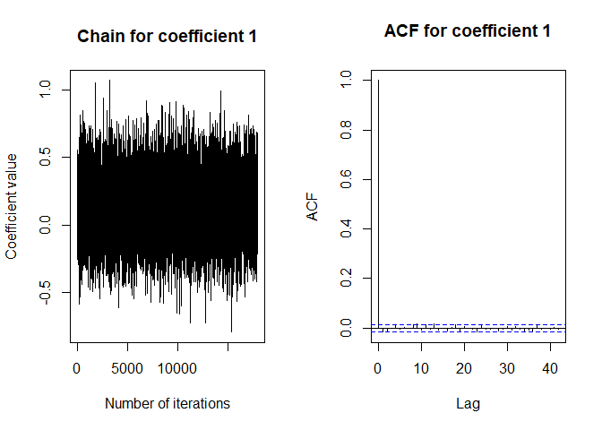
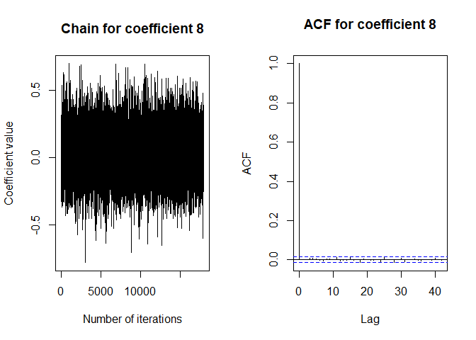
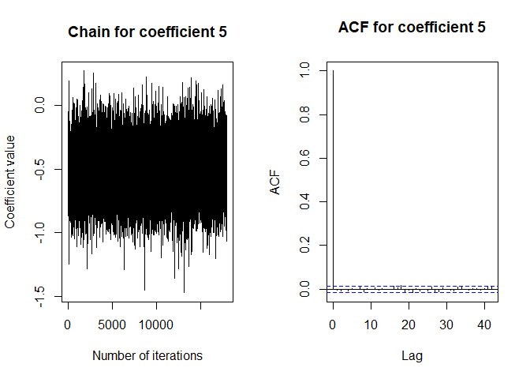
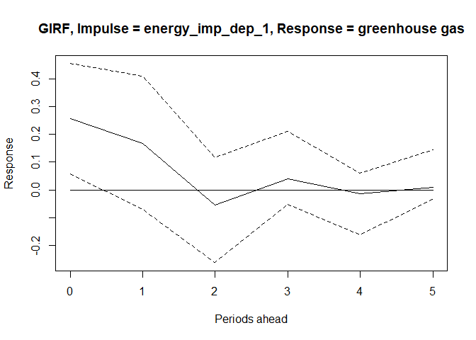
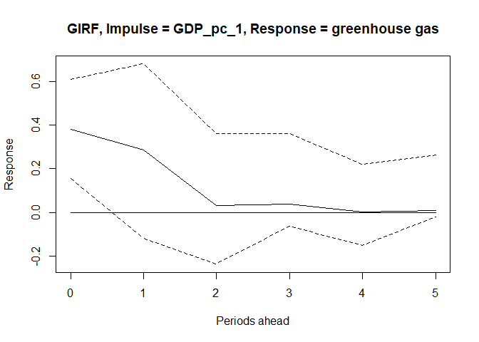

## Data Preprocessing


```
## Warning: package 'xts' was built under R version 4.2.3
```

```
## Warning: package 'zoo' was built under R version 4.2.3
```

```
## Warning: package 'imputeTS' was built under R version 4.2.3
```

```
## Warning: package 'MTS' was built under R version 4.2.3
```

```
## Warning: package 'tseries' was built under R version 4.2.3
```

```
## Warning: package 'vars' was built under R version 4.2.3
```

```
## Warning: package 'strucchange' was built under R version 4.2.3
```

```
## Warning: package 'sandwich' was built under R version 4.2.3
```

```
## Warning: package 'urca' was built under R version 4.2.3
```

```
## Warning: package 'bvartools' was built under R version 4.2.3
```

```
## Warning: package 'coda' was built under R version 4.2.3
```


```r
data <- data %>% 
  dplyr::mutate(livestock_heads = Pigs_heads + Head_sheep + Head_goat + 
           Chicken_heads + Turkeys_heads + Cattle_heads + Buffalo_head) 

data <- data %>% 
  dplyr::mutate(res_capacity = hydro_capacity + geothermal_capacity + 
           wind_capacity + solar_capacity + biofuels_capacity + 
           biogas_capacity + waste_capacity)

data <- data %>% dplyr::select(Year, net_greenhouse_pc, environmental_taxes, `GDP pc`,
                                 industrial_production, energy_imp_dep, naturalgas_imports,
                                 oil_imports, total_energy_supply, gross_electricity_production,
                                 res_capacity, livestock_heads,
                                 Share_of_land_under_permanent_crops, Area_harvested_Rice,
                                 Fertilizer_used_per_area_of_cropland, Share_in_land_area_Forest_Land,
                                 Rail_tracks_KM, Length_of_motorways, Number_of_motorcycle, Total_freight_loaded_and_unloaded)
```


```r
data <- apply(data, MARGIN = 2, FUN = scale)
data <- data.frame(data)
```


```r
par(mfrow = c(2,2))
plot(data$net_greenhouse_pc,
     type = 'l',
     xlab = "Time",
     ylab = "TON per capita - Scaled",
     main = "Net greenhouse gases emissions")

plot(data$environmental_taxes,
     type = 'l',
     xlab = "Time",
     ylab = "% of GDP - Scaled",
     main = "Environmental taxes")

plot(data$GDP.pc,
     type = 'l',
     xlab = "Time",
     ylab = "Constant 2010 US dollars - Scaled",
     main = "GDP per capita")

plot(data$industrial_production,
     type = 'l',
     xlab = "Time",
     ylab = "Index 2015=100 - Scaled",
     main = "Industrial production")
```

<!-- -->


```r
par(mfrow = c(2,2))
plot(data$energy_imp_dep,
     type = 'l',
     xlab = "Time",
     ylab = "% - Scaled",
     main = "Energy imports dependency")

plot(data$naturalgas_imports,
     type = 'l',
     xlab = "Time",
     ylab = "Million m^3 - Scaled",
     main = "Natural gas imports")

plot(data$oil_imports,
     type = 'l',
     xlab = "Time",
     ylab = "Thousand tonnes - Scaled",
     main = "Oil imports")

plot(data$total_energy_supply,
     type = 'l',
     xlab = "Time",
     ylab = "Gigawatt-hour - Scaled",
     main = "Total energy supply")
```

<!-- -->


```r
par(mfrow = c(2,2))
plot(data$gross_electricity_production,
     type = 'l',
     xlab = "Time",
     ylab = "Gigawatt-hour - Scaled - Scaled",
     main = "Gross electricity production")

plot(data$res_capacity,
     type = 'l',
     xlab = "Time",
     ylab = "Megawatt - Scaled",
     main = "Renewable Energy capacity")

plot(data$livestock_heads,
     type = 'l',
     xlab = "Time",
     ylab = "Thousand heads - Scaled",
     main = "Livestock heads")

plot(data$Share_of_land_under_permanent_crops,
     type = 'l',
     xlab = "Time",
     ylab = "% - Scaled",
     main = "Share of land under permanent crops")
```

<!-- -->


```r
par(mfrow = c(2,2))
plot(data$Area_harvested_Rice,
     type = 'l',
     xlab = "Time",
     ylab = "Area ha - Scaled",
     main = "Harvested rice")

plot(data$Fertilizer_used_per_area_of_cropland,
     type = 'l',
     xlab = "Time",
     ylab = "kg per ha - Scaled",
     main = "Fertilizer used per ha of cropland")

plot(data$Share_in_land_area_Forest_Land,
     type = 'l',
     xlab = "Time",
     ylab = "% - Scaled",
     main = "Share of forest land in total land")

plot(data$Rail_tracks_KM,
     type = 'l',
     xlab = "Time",
     ylab = "km - Scaled",
     main = "Rail tracks")
```

<!-- -->


```r
par(mfrow = c(2,2))
plot(data$Length_of_motorways,
     type = 'l',
     xlab = "Time",
     ylab = "km - Scaled",
     main = "Length of motorways")

plot(data$Number_of_motorcycle,
     type = 'l',
     xlab = "Time",
     ylab = "Units - Scaled",
     main = "Number of motorcycles")

plot(data$Total_freight_loaded_and_unloaded,
     type = 'l',
     xlab = "Time",
     ylab = "TON - Scaled",
     main = "Total aerial freight")
```

<!-- -->


```r
greenhouse_1 <- diff(data$net_greenhouse_pc, differences = 1)
env_tax_1 <- diff(data$environmental_taxes, differences = 1)
GDP_pc_1 <- diff(data$GDP.pc, differences = 1)
ind_prod_1 <- diff(data$industrial_production, differences = 1)
energy_imp_dep_1 <- diff(data$energy_imp_dep, differences = 1)
naturalgas_imports_1  <- diff(data$naturalgas_imports , differences = 1)
oil_imports_1  <- diff(data$oil_imports , differences = 1)
energy_supply_1 <- diff(data$total_energy_supply , differences = 1)
electricity_prod_1 <- diff(data$gross_electricity_production, differences = 1)
res_capacity_1  <- diff(data$res_capacity  , differences = 1)
livestock_heads_1 <- diff(data$livestock_heads , differences = 1)
permanent_crops_1 <- diff(data$Share_of_land_under_permanent_crops , differences = 1)
harvested_rice_1 <- diff(data$Area_harvested_Rice, differences = 1)
fertilizer_1 <- diff(data$Fertilizer_used_per_area_of_cropland, differences = 1)
forest_land_1 <- diff(data$Share_in_land_area_Forest_Land, differences = 1)
rail_tracks_1 <- diff(data$Rail_tracks_KM , differences = 1)
motorways_len_1 <- diff(data$Length_of_motorways , differences = 1)
motorcycles_1 <- diff(data$Number_of_motorcycle , differences = 1)
aerial_freight_1 <- diff(data$Total_freight_loaded_and_unloaded , differences = 1)
```


```r
bayes_1 <- cbind(greenhouse_1, harvested_rice_1, permanent_crops_1)
bayes_2 <- cbind(greenhouse_1, energy_imp_dep_1, oil_imports_1)
bayes_3 <- cbind(greenhouse_1, GDP_pc_1, fertilizer_1)
```


```r
rm(list = ls()[!ls() %in% c("bayes_1", "bayes_2", "bayes_3")])
```

## Model 1

Model 1 includes: net greenhouse gas emission per capita, area of harvester rice, and share of land under permanent crops


```r
bayes <- bayes_1
head(bayes)
```

```
##      greenhouse_1 harvested_rice_1 permanent_crops_1
## [1,]  -0.24713412       -0.8858458         1.1820050
## [2,]   0.00000000        1.1076954        -0.5319023
## [3,]   0.08237804        1.4877318        -0.3398264
## [4,]  -0.24713412        0.4086653         0.1920758
## [5,]   0.32951216        0.3210317        -0.9899292
## [6,]  -0.08237804        0.5571473         0.2511761
```

```r
bayes_ts <- as.ts(bayes)
plot(bayes_ts, main = "Model 1 time series", las = 1.5, lty = )
```

<!-- -->

```r
summary(bayes_ts)
```

```
##   greenhouse_1      harvested_rice_1   permanent_crops_1 
##  Min.   :-0.90616   Min.   :-1.84710   Min.   :-1.84688  
##  1st Qu.:-0.22654   1st Qu.:-0.48152   1st Qu.:-0.41001  
##  Median :-0.08238   Median : 0.15120   Median : 0.19946  
##  Mean   :-0.09062   Mean   : 0.04269   Mean   : 0.05368  
##  3rd Qu.: 0.14416   3rd Qu.: 0.65092   3rd Qu.: 0.43217  
##  Max.   : 0.32951   Max.   : 1.48773   Max.   : 2.36401
```

## Model selection


```r
VARselect(bayes_ts, lag.max = 4,type = "const") 
```

```
## $selection
## AIC(n)  HQ(n)  SC(n) FPE(n) 
##      1      1      1      1 
## 
## $criteria
##                  1          2          3           4
## AIC(n) -2.63631094 -2.0678125 -1.5633068 -1.93325579
## HQ(n)  -2.46910188 -1.7751967 -1.1452841 -1.38982637
## SC(n)  -2.05565100 -1.0516576 -0.1116569 -0.04611099
## FPE(n)  0.07215613  0.1317313  0.2373526  0.19448137
```

```r
bmodel <- gen_var(bayes_ts, p = 1, deterministic = "const")
y <- t(bmodel$data$Y)
x <- t(bmodel$data$Z)
```

# OLS estimation, Model 1


```r
beta_ols <- tcrossprod(y, x) %*% solve(tcrossprod(x)) # Calculate estimates
round(beta_ols, 3) # Round estimates and print
```

```
##                   greenhouse_1.01 harvested_rice_1.01 permanent_crops_1.01
## greenhouse_1                0.136               0.084                0.135
## harvested_rice_1           -0.987               0.209                0.036
## permanent_crops_1          -0.382               0.026               -0.203
##                    const
## greenhouse_1      -0.082
## harvested_rice_1  -0.007
## permanent_crops_1 -0.007
```

```r
tab_ols_11 <- xtable(round(beta_ols, 3), caption = "OLS betas, Model 1", label = "tab:tab_ols_11")


e_ols <- y - beta_ols %*% x
e_sigma_ols <- tcrossprod(e_ols) / (ncol(y) - nrow(x))
round(e_sigma_ols, 2)
```

```
##                   greenhouse_1 harvested_rice_1 permanent_crops_1
## greenhouse_1              0.07             0.03              0.00
## harvested_rice_1          0.03             0.71              0.12
## permanent_crops_1         0.00             0.12              0.82
```

```r
tab_ols_12 <- xtable(round(e_sigma_ols, 2), caption = "OLS var-covar, Model 1", label = "tab:tab_ols_12")
```

# Bayesian estimation, Model 1


```r
set.seed(1234567)
iter <- 20000 # Number of iterations of the Gibbs sampler
burnin <- 2000 # Number of burn-in draws
store <- iter - burnin

t <- ncol(y) # Number of observations
k <- nrow(y) # Number of endogenous variables
m <- k * nrow(x) # Number of estimated coefficients
```


```r
a_mu_prior <- matrix(c(beta_ols), m) # Vector of prior parameter means
a_v_i_prior <- diag(1, m) # Inverse of the prior covariance matrix

u_sigma_df_prior <- 2*k # Prior degrees of freedom
u_sigma_scale_prior <- diag(1, k) # Prior covariance matrix
u_sigma_df_post <- t + u_sigma_df_prior # Posterior degrees of freedom
```


```r
u_sigma_i <- solve(e_sigma_ols) #Inverse error variance-covariance

# Data containers for Gibss sampler
draws_a <- matrix(NA, m, store)
draws_sigma <- matrix(NA, k * k, store)
```


```r
for (draw in 1:iter) {
  # Draw conditional mean parameters
  a <- post_normal(y, x, u_sigma_i, a_mu_prior, a_v_i_prior) #Draw the coefficients from a Normal density
  
  # Draw variance-covariance matrix
  u <- y - matrix(a, k) %*% x # Obtain residuals
  u_sigma_scale_post <- solve(u_sigma_scale_prior + tcrossprod(u))
  u_sigma_i <- matrix(rWishart(1, u_sigma_df_post, u_sigma_scale_post)[,, 1], k) #Draw from the iW density
  u_sigma <- solve(u_sigma_i) # Invert Sigma_i to obtain Sigma
  
  # Store draws
  if (draw > burnin) {
    draws_a[, draw - burnin] <- a
    draws_sigma[, draw - burnin] <- u_sigma
  }
}
```


```r
A <- rowMeans(draws_a) # Obtain means for every row
A <- matrix(A, k) # Transform mean vector into a matrix
A <- round(A, 3) # Round values
dimnames(A) <- list(dimnames(y)[[1]], dimnames(x)[[1]]) # Rename matrix dimensions

round(A,2) # Print
```

```
##                   greenhouse_1.01 harvested_rice_1.01 permanent_crops_1.01
## greenhouse_1                 0.14                0.08                 0.14
## harvested_rice_1            -0.99                0.21                 0.04
## permanent_crops_1           -0.38                0.02                -0.20
##                   const
## greenhouse_1      -0.08
## harvested_rice_1  -0.01
## permanent_crops_1 -0.01
```

```r
tab_bayes_A1 <- xtable(round(A, 2), caption = "Bayesian coefficients, Model 1", label = "tab:tab_bayes_A1")

Sigma <- rowMeans(draws_sigma) # Obtain means for every row
Sigma <- matrix(Sigma, k) # Transform mean vector into a matrix
Sigma <- round(Sigma, 2) # Round values
dimnames(Sigma) <- list(dimnames(y)[[1]], dimnames(y)[[1]]) # Rename matrix dimensions

round(Sigma,3) # Print
```

```
##                   greenhouse_1 harvested_rice_1 permanent_crops_1
## greenhouse_1              0.11             0.02              0.00
## harvested_rice_1          0.02             0.69              0.11
## permanent_crops_1         0.00             0.11              0.79
```

```r
tab_bayes_Sigma1 <- xtable(round(Sigma, 3), caption = "Bayesian var-covar, Model 1", label = "tab:tab_bayes_Sigma1")
```


```r
bvar_model <- bvar(y = bmodel$data$Y, x = bmodel$data$Z, A = draws_a[1:9,],
                 C = draws_a[10:12, ], Sigma = draws_sigma)
#bvar_model <- thin.bvar(bvar_model, thin = 2)
summary(bvar_model)
```

```
## 
## Bayesian VAR model with p = 1 
## 
## Model:
## 
## y ~ greenhouse_1.01 + harvested_rice_1.01 + permanent_crops_1.01 + const
## 
## Variable: greenhouse_1 
## 
##                          Mean      SD  Naive SD Time-series SD      2.5%
## greenhouse_1.01       0.13617 0.20795 0.0015500      0.0015090 -0.275600
## harvested_rice_1.01   0.08355 0.07175 0.0005348      0.0005348 -0.058239
## permanent_crops_1.01  0.13603 0.06775 0.0005050      0.0005050  0.004856
## const                -0.08171 0.06214 0.0004632      0.0004632 -0.203805
##                           50%   97.5%
## greenhouse_1.01       0.13774 0.54318
## harvested_rice_1.01   0.08355 0.22282
## permanent_crops_1.01  0.13638 0.27094
## const                -0.08167 0.04092
## 
## Variable: harvested_rice_1 
## 
##                           Mean     SD Naive SD Time-series SD    2.5%      50%
## greenhouse_1.01      -0.994202 0.4729 0.003525       0.003525 -1.9307 -0.99830
## harvested_rice_1.01   0.211020 0.1815 0.001353       0.001353 -0.1435  0.21033
## permanent_crops_1.01  0.036640 0.1698 0.001266       0.001266 -0.2937  0.03673
## const                -0.009939 0.1554 0.001158       0.001158 -0.3141 -0.01169
##                         97.5%
## greenhouse_1.01      -0.06212
## harvested_rice_1.01   0.57232
## permanent_crops_1.01  0.37262
## const                 0.30138
## 
## Variable: permanent_crops_1 
## 
##                           Mean     SD Naive SD Time-series SD    2.5%       50%
## greenhouse_1.01      -0.384136 0.5027 0.003747       0.003747 -1.3731 -0.383087
## harvested_rice_1.01   0.024367 0.1937 0.001444       0.001444 -0.3576  0.024224
## permanent_crops_1.01 -0.203281 0.1846 0.001376       0.001376 -0.5652 -0.202007
## const                -0.009163 0.1669 0.001244       0.001244 -0.3410 -0.008836
##                       97.5%
## greenhouse_1.01      0.6071
## harvested_rice_1.01  0.4063
## permanent_crops_1.01 0.1600
## const                0.3242
## 
## Variance-covariance matrix:
## 
##                                         Mean      SD  Naive SD Time-series SD
## greenhouse_1_greenhouse_1           0.105837 0.03017 0.0002249      0.0002528
## greenhouse_1_harvested_rice_1       0.022605 0.05231 0.0003899      0.0004381
## greenhouse_1_permanent_crops_1      0.003939 0.05653 0.0004213      0.0004712
## harvested_rice_1_greenhouse_1       0.022605 0.05231 0.0003899      0.0004381
## harvested_rice_1_harvested_rice_1   0.686331 0.18868 0.0014063      0.0015291
## harvested_rice_1_permanent_crops_1  0.108410 0.14235 0.0010610      0.0011768
## permanent_crops_1_greenhouse_1      0.003939 0.05653 0.0004213      0.0004712
## permanent_crops_1_harvested_rice_1  0.108410 0.14235 0.0010610      0.0011768
## permanent_crops_1_permanent_crops_1 0.788902 0.22017 0.0016411      0.0019248
##                                         2.5%      50%  97.5%
## greenhouse_1_greenhouse_1            0.06270 0.100771 0.1779
## greenhouse_1_harvested_rice_1       -0.07774 0.020861 0.1311
## greenhouse_1_permanent_crops_1      -0.10800 0.003959 0.1158
## harvested_rice_1_greenhouse_1       -0.07774 0.020861 0.1311
## harvested_rice_1_harvested_rice_1    0.40848 0.656425 1.1320
## harvested_rice_1_permanent_crops_1  -0.15340 0.100428 0.4184
## permanent_crops_1_greenhouse_1      -0.10800 0.003959 0.1158
## permanent_crops_1_harvested_rice_1  -0.15340 0.100428 0.4184
## permanent_crops_1_permanent_crops_1  0.46561 0.752638 1.3131
```


```r
str(draws_a)
```

```
##  num [1:12, 1:18000] 0.135 -1.193 -0.226 0.12 0.209 ...
```

```r
for (i in 1:nrow(draws_a)){
  par(mfrow = c(1, 2))
  ts.plot(draws_a[i,], 
          xlab = 'Number of iterations', 
          ylab = "Coefficient value", 
          main = paste0("Chain for coefficient ", i))
  acf(draws_a[i,], main = paste0("ACF for coefficient ", i))
}
```

<!-- --><!-- --><!-- --><!-- --><!-- --><!-- --><!-- --><!-- --><!-- --><!-- --><!-- --><!-- -->

```r
plot(bvar_model)
```

<!-- -->


```r
GIR_1 <- bvartools::irf(bvar_model, impulse = "harvested_rice_1", response = "greenhouse_1", n.ahead = 5, type = "gir")
round(GIR_1, 2)
```

```
## Time Series:
## Start = 0 
## End = 5 
## Frequency = 1 
##    2.5%  50% 97.5%
## 0 -0.11 0.03  0.18
## 1 -0.05 0.11  0.27
## 2 -0.07 0.02  0.14
## 3 -0.07 0.00  0.06
## 4 -0.05 0.00  0.03
## 5 -0.03 0.00  0.02
```

```r
tab_GIR_11 <- xtable(round(GIR_1, 3), caption = "GIRF betas, Model 1", label = "tab:tab_GIR_11")
plot(GIR_1, main = "GIRF, Impulse = harvested_rice, Response = greenhouse gas", xlab = "Periods ahead", ylab = "Response")
```

<!-- -->

```r
GIR_2 <- bvartools::irf(bvar_model, impulse = "permanent_crops_1", response = "greenhouse_1", n.ahead = 5, type = "gir")
round(GIR_2, 2)
```

```
## Time Series:
## Start = 0 
## End = 5 
## Frequency = 1 
##    2.5%  50% 97.5%
## 0 -0.13 0.01  0.14
## 1  0.01 0.15  0.29
## 2 -0.10 0.00  0.11
## 3 -0.07 0.00  0.06
## 4 -0.04 0.00  0.03
## 5 -0.02 0.00  0.03
```

```r
tab_GIR_12 <- xtable(round(GIR_1, 3), caption = "GIRF betas, Model 1", label = "tab:tab_GIR_12")
plot(GIR_2, main = "GIRF, Impulse = permanent_crops, Response = greenhouse gas", xlab = "Periods ahead", ylab = "Response")
```

<!-- -->


```r
bvar_fevd_gir <- bvartools::fevd(bvar_model, response = "greenhouse_1", type = "gir")
round(bvar_fevd_gir, 2)
```

```
## Time Series:
## Start = 0 
## End = 5 
## Frequency = 1 
##   greenhouse_1 harvested_rice_1 permanent_crops_1
## 0         0.32             0.09              0.09
## 1         0.26             0.26              0.45
## 2         0.26             0.28              0.46
## 3         0.26             0.28              0.47
## 4         0.26             0.28              0.47
## 5         0.26             0.28              0.47
```

```r
plot(bvar_fevd_gir, main = "GIR-based FEVD of Net Greenhouse gas emissions per capita")
```

<!-- -->


```r
print(tab_ols_11, caption.placement = "top") #OLS coefficients
```

```
## % latex table generated in R 4.2.2 by xtable 1.8-4 package
## % Thu May  4 20:35:01 2023
## \begin{table}[ht]
## \centering
## \caption{OLS betas, Model 1} 
## \label{tab:tab_ols_11}
## \begin{tabular}{rrrrr}
##   \hline
##  & greenhouse\_1.01 & harvested\_rice\_1.01 & permanent\_crops\_1.01 & const \\ 
##   \hline
## greenhouse\_1 & 0.14 & 0.08 & 0.14 & -0.08 \\ 
##   harvested\_rice\_1 & -0.99 & 0.21 & 0.04 & -0.01 \\ 
##   permanent\_crops\_1 & -0.38 & 0.03 & -0.20 & -0.01 \\ 
##    \hline
## \end{tabular}
## \end{table}
```

```r
cat("\n")
```

```r
print(tab_ols_12, caption.placement = "top") #OLS error var-covar
```

```
## % latex table generated in R 4.2.2 by xtable 1.8-4 package
## % Thu May  4 20:35:01 2023
## \begin{table}[ht]
## \centering
## \caption{OLS var-covar, Model 1} 
## \label{tab:tab_ols_12}
## \begin{tabular}{rrrr}
##   \hline
##  & greenhouse\_1 & harvested\_rice\_1 & permanent\_crops\_1 \\ 
##   \hline
## greenhouse\_1 & 0.07 & 0.03 & 0.00 \\ 
##   harvested\_rice\_1 & 0.03 & 0.71 & 0.12 \\ 
##   permanent\_crops\_1 & 0.00 & 0.12 & 0.82 \\ 
##    \hline
## \end{tabular}
## \end{table}
```

```r
cat("\n")
```

```r
print(tab_bayes_A1, caption.placement = "top") #Bayesian coefficients
```

```
## % latex table generated in R 4.2.2 by xtable 1.8-4 package
## % Thu May  4 20:35:01 2023
## \begin{table}[ht]
## \centering
## \caption{Bayesian coefficients, Model 1} 
## \label{tab:tab_bayes_A1}
## \begin{tabular}{rrrrr}
##   \hline
##  & greenhouse\_1.01 & harvested\_rice\_1.01 & permanent\_crops\_1.01 & const \\ 
##   \hline
## greenhouse\_1 & 0.14 & 0.08 & 0.14 & -0.08 \\ 
##   harvested\_rice\_1 & -0.99 & 0.21 & 0.04 & -0.01 \\ 
##   permanent\_crops\_1 & -0.38 & 0.02 & -0.20 & -0.01 \\ 
##    \hline
## \end{tabular}
## \end{table}
```

```r
cat("\n")
```

```r
print(tab_bayes_Sigma1, caption.placement = "top") #Bayesian error var-covar
```

```
## % latex table generated in R 4.2.2 by xtable 1.8-4 package
## % Thu May  4 20:35:01 2023
## \begin{table}[ht]
## \centering
## \caption{Bayesian var-covar, Model 1} 
## \label{tab:tab_bayes_Sigma1}
## \begin{tabular}{rrrr}
##   \hline
##  & greenhouse\_1 & harvested\_rice\_1 & permanent\_crops\_1 \\ 
##   \hline
## greenhouse\_1 & 0.11 & 0.02 & 0.00 \\ 
##   harvested\_rice\_1 & 0.02 & 0.69 & 0.11 \\ 
##   permanent\_crops\_1 & 0.00 & 0.11 & 0.79 \\ 
##    \hline
## \end{tabular}
## \end{table}
```

```r
cat("\n")
```

```r
print(tab_GIR_11, caption.placement = "top") #GIRF 1 coefficients
```

```
## % latex table generated in R 4.2.2 by xtable 1.8-4 package
## % Thu May  4 20:35:01 2023
## \begin{table}[ht]
## \centering
## \caption{GIRF betas, Model 1} 
## \label{tab:tab_GIR_11}
## \begin{tabular}{rrrr}
##   \hline
##  & X2.5. & X50. & X97.5. \\ 
##   \hline
## 0 & -0.11 & 0.03 & 0.18 \\ 
##   1 & -0.05 & 0.11 & 0.27 \\ 
##   2 & -0.07 & 0.02 & 0.14 \\ 
##   3 & -0.07 & -0.00 & 0.06 \\ 
##   4 & -0.05 & -0.00 & 0.03 \\ 
##   5 & -0.03 & -0.00 & 0.02 \\ 
##    \hline
## \end{tabular}
## \end{table}
```

```r
cat("\n")
```

```r
print(tab_GIR_12, caption.placement = "top") #GIRF 2 coefficients
```

```
## % latex table generated in R 4.2.2 by xtable 1.8-4 package
## % Thu May  4 20:35:01 2023
## \begin{table}[ht]
## \centering
## \caption{GIRF betas, Model 1} 
## \label{tab:tab_GIR_12}
## \begin{tabular}{rrrr}
##   \hline
##  & X2.5. & X50. & X97.5. \\ 
##   \hline
## 0 & -0.11 & 0.03 & 0.18 \\ 
##   1 & -0.05 & 0.11 & 0.27 \\ 
##   2 & -0.07 & 0.02 & 0.14 \\ 
##   3 & -0.07 & -0.00 & 0.06 \\ 
##   4 & -0.05 & -0.00 & 0.03 \\ 
##   5 & -0.03 & -0.00 & 0.02 \\ 
##    \hline
## \end{tabular}
## \end{table}
```


```r
rm(list = ls()[!ls() %in% c("bayes_1", "bayes_2", "bayes_3")])
```


## Model 2

Model 2 includes: net greenhouse gas emission per capita, energy import dependency, and oil imports


```r
bayes <- bayes_2
head(bayes)
```

```
##      greenhouse_1 energy_imp_dep_1 oil_imports_1
## [1,]  -0.24713412      -0.76056690   -0.26076304
## [2,]   0.00000000       0.65069367    0.42766551
## [3,]   0.08237804      -1.09354382   -0.09012027
## [4,]  -0.24713412       0.09644428   -0.13062852
## [5,]   0.32951216       0.38241987   -0.13140481
## [6,]  -0.08237804      -0.02289026    0.07177159
```

```r
bayes_ts <- as.ts(bayes)
plot(bayes_ts, main = "Model 2 time series", las = 1.5)
```

<!-- -->

```r
summary(bayes_ts)
```

```
##   greenhouse_1      energy_imp_dep_1  oil_imports_1     
##  Min.   :-0.90616   Min.   :-1.2300   Min.   :-1.05761  
##  1st Qu.:-0.22654   1st Qu.:-0.6683   1st Qu.:-0.30411  
##  Median :-0.08238   Median :-0.1280   Median :-0.07632  
##  Mean   :-0.09062   Mean   :-0.1114   Mean   :-0.10462  
##  3rd Qu.: 0.14416   3rd Qu.: 0.3665   3rd Qu.: 0.07876  
##  Max.   : 0.32951   Max.   : 1.0884   Max.   : 0.65244
```

## Model selection


```r
VARselect(bayes_ts, lag.max = 4,type = "const") 
```

```
## $selection
## AIC(n)  HQ(n)  SC(n) FPE(n) 
##      1      1      1      1 
## 
## $criteria
##                   1            2            3            4
## AIC(n) -6.442610257 -5.923799618 -5.682105167 -5.518600348
## HQ(n)  -6.275401204 -5.631183775 -5.264082534 -4.975170925
## SC(n)  -5.861950316 -4.907644722 -4.230455315 -3.631455541
## FPE(n)  0.001604052  0.002786473  0.003860314  0.005392407
```

```r
bmodel <- gen_var(bayes_ts, p = 1, deterministic = "const")
y <- t(bmodel$data$Y)
x <- t(bmodel$data$Z)
```

# OLS estimation, Model 2


```r
beta_ols <- tcrossprod(y, x) %*% solve(tcrossprod(x)) # Calculate estimates
round(beta_ols, 3) # Round estimates and print
```

```
##                  greenhouse_1.01 energy_imp_dep_1.01 oil_imports_1.01  const
## greenhouse_1              -0.060               0.120            0.194 -0.067
## energy_imp_dep_1           0.143              -0.511           -0.022 -0.117
## oil_imports_1              0.008              -0.023           -0.045 -0.103
```

```r
tab_ols_21 <- xtable(round(beta_ols, 3), caption = "OLS betas, Model 2", label = "tab:tab_ols_11")


e_ols <- y - beta_ols %*% x
e_sigma_ols <- tcrossprod(e_ols) / (ncol(y) - nrow(x))
round(e_sigma_ols, 2)
```

```
##                  greenhouse_1 energy_imp_dep_1 oil_imports_1
## greenhouse_1             0.09             0.09          0.09
## energy_imp_dep_1         0.09             0.33          0.12
## oil_imports_1            0.09             0.12          0.13
```

```r
tab_ols_22 <- xtable(round(e_sigma_ols, 2), caption = "OLS var-covar, Model 2", label = "tab:tab_ols_12")
```

# Bayesian estimation, Model 2


```r
set.seed(1234567)
iter <- 20000 # Number of iterations of the Gibbs sampler
burnin <- 2000 # Number of burn-in draws
store <- iter - burnin

t <- ncol(y) # Number of observations
k <- nrow(y) # Number of endogenous variables
m <- k * nrow(x) # Number of estimated coefficients
```


```r
a_mu_prior <- matrix(c(beta_ols), m) # Vector of prior parameter means
a_v_i_prior <- diag(1, m) # Inverse of the prior covariance matrix

u_sigma_df_prior <- 2*k # Prior degrees of freedom
u_sigma_scale_prior <- diag(1, k) # Prior covariance matrix
u_sigma_df_post <- t + u_sigma_df_prior # Posterior degrees of freedom
```


```r
u_sigma_i <- solve(e_sigma_ols)

# Data containers for Gibss sampler
draws_a <- matrix(NA, m, store)
draws_sigma <- matrix(NA, k * k, store)
```


```r
for (draw in 1:iter) {
  # Draw conditional mean parameters
  a <- post_normal(y, x, u_sigma_i, a_mu_prior, a_v_i_prior) #Draw the coefficients from a Normal density
  
  # Draw variance-covariance matrix
  u <- y - matrix(a, k) %*% x # Obtain residuals
  u_sigma_scale_post <- solve(u_sigma_scale_prior + tcrossprod(u))
  u_sigma_i <- matrix(rWishart(1, u_sigma_df_post, u_sigma_scale_post)[,, 1], k) #Draw from the iW density
  u_sigma <- solve(u_sigma_i) # Invert Sigma_i to obtain Sigma
  
  # Store draws
  if (draw > burnin) {
    draws_a[, draw - burnin] <- a
    draws_sigma[, draw - burnin] <- u_sigma
  }
}
```


```r
A <- rowMeans(draws_a) # Obtain means for every row
A <- matrix(A, k) # Transform mean vector into a matrix
A <- round(A, 3) # Round values
dimnames(A) <- list(dimnames(y)[[1]], dimnames(x)[[1]]) # Rename matrix dimensions

A # Print
```

```
##                  greenhouse_1.01 energy_imp_dep_1.01 oil_imports_1.01  const
## greenhouse_1              -0.061               0.119            0.197 -0.067
## energy_imp_dep_1           0.136              -0.510           -0.018 -0.119
## oil_imports_1              0.007              -0.024           -0.043 -0.105
```

```r
tab_bayes_A2 <- xtable(round(A, 3), caption = "Bayesian coefficients, Model 2", label = "tab:tab_bayes_A2")

Sigma <- rowMeans(draws_sigma) # Obtain means for every row
Sigma <- matrix(Sigma, k) # Transform mean vector into a matrix
Sigma <- round(Sigma, 2) # Round values
dimnames(Sigma) <- list(dimnames(y)[[1]], dimnames(y)[[1]]) # Rename matrix dimensions

Sigma # Print
```

```
##                  greenhouse_1 energy_imp_dep_1 oil_imports_1
## greenhouse_1             0.12             0.08          0.08
## energy_imp_dep_1         0.08             0.33          0.11
## oil_imports_1            0.08             0.11          0.16
```

```r
tab_bayes_Sigma2 <- xtable(round(Sigma, 3), caption = "Bayesian var-covar, Model 2", label = "tab:tab_bayes_Sigma2")
```


```r
bvar_model <- bvar(y = bmodel$data$Y, x = bmodel$data$Z, A = draws_a[1:9,],
                 C = draws_a[10:12, ], Sigma = draws_sigma)
#bvar_model <- thin.bvar(bvar_model, thin = 2)
summary(bvar_model)
```

```
## 
## Bayesian VAR model with p = 1 
## 
## Model:
## 
## y ~ greenhouse_1.01 + energy_imp_dep_1.01 + oil_imports_1.01 + const
## 
## Variable: greenhouse_1 
## 
##                         Mean      SD  Naive SD Time-series SD    2.5%      50%
## greenhouse_1.01     -0.06147 0.28651 0.0021355      0.0021961 -0.6319 -0.06235
## energy_imp_dep_1.01  0.11905 0.11925 0.0008888      0.0008736 -0.1162  0.11884
## oil_imports_1.01     0.19681 0.30494 0.0022729      0.0022729 -0.3974  0.19296
## const               -0.06727 0.06572 0.0004899      0.0004899 -0.1965 -0.06762
##                       97.5%
## greenhouse_1.01     0.50296
## energy_imp_dep_1.01 0.35497
## oil_imports_1.01    0.80212
## const               0.06413
## 
## Variable: energy_imp_dep_1 
## 
##                         Mean     SD  Naive SD Time-series SD    2.5%     50%
## greenhouse_1.01      0.13618 0.4393 0.0032741      0.0034835 -0.7245  0.1388
## energy_imp_dep_1.01 -0.51011 0.1986 0.0014800      0.0014800 -0.8996 -0.5103
## oil_imports_1.01    -0.01833 0.4656 0.0034704      0.0034704 -0.9292 -0.0190
## const               -0.11901 0.1094 0.0008151      0.0008151 -0.3334 -0.1204
##                        97.5%
## greenhouse_1.01      1.00075
## energy_imp_dep_1.01 -0.11971
## oil_imports_1.01     0.89426
## const                0.09942
## 
## Variable: oil_imports_1 
## 
##                          Mean      SD  Naive SD Time-series SD    2.5%
## greenhouse_1.01      0.006738 0.32277 0.0024058      0.0024058 -0.6247
## energy_imp_dep_1.01 -0.023931 0.13783 0.0010273      0.0010273 -0.2959
## oil_imports_1.01    -0.043268 0.34512 0.0025724      0.0025724 -0.7240
## const               -0.104702 0.07528 0.0005611      0.0005611 -0.2525
##                           50%   97.5%
## greenhouse_1.01      0.005053 0.65026
## energy_imp_dep_1.01 -0.022274 0.24844
## oil_imports_1.01    -0.041763 0.62531
## const               -0.104972 0.04733
## 
## Variance-covariance matrix:
## 
##                                      Mean      SD  Naive SD Time-series SD
## greenhouse_1_greenhouse_1         0.11911 0.03342 0.0002491      0.0002777
## greenhouse_1_energy_imp_dep_1     0.08497 0.04163 0.0003103      0.0003436
## greenhouse_1_oil_imports_1        0.07893 0.03084 0.0002298      0.0002566
## energy_imp_dep_1_greenhouse_1     0.08497 0.04163 0.0003103      0.0003436
## energy_imp_dep_1_energy_imp_dep_1 0.33229 0.09109 0.0006790      0.0007373
## energy_imp_dep_1_oil_imports_1    0.10825 0.04855 0.0003619      0.0004002
## oil_imports_1_greenhouse_1        0.07893 0.03084 0.0002298      0.0002566
## oil_imports_1_energy_imp_dep_1    0.10825 0.04855 0.0003619      0.0004002
## oil_imports_1_oil_imports_1       0.15656 0.04364 0.0003252      0.0003783
##                                      2.5%     50%  97.5%
## greenhouse_1_greenhouse_1         0.07024 0.11351 0.1996
## greenhouse_1_energy_imp_dep_1     0.01759 0.07963 0.1808
## greenhouse_1_oil_imports_1        0.03145 0.07492 0.1506
## energy_imp_dep_1_greenhouse_1     0.01759 0.07963 0.1808
## energy_imp_dep_1_energy_imp_dep_1 0.19957 0.31739 0.5492
## energy_imp_dep_1_oil_imports_1    0.03146 0.10180 0.2218
## oil_imports_1_greenhouse_1        0.03145 0.07492 0.1506
## oil_imports_1_energy_imp_dep_1    0.03146 0.10180 0.2218
## oil_imports_1_oil_imports_1       0.09263 0.14955 0.2618
```


```r
str(draws_a)
```

```
##  num [1:12, 1:18000] -0.0345 0.05563 -0.00728 0.21593 -0.46673 ...
```

```r
for (i in 1:nrow(draws_a)){
  par(mfrow = c(1, 2))
  ts.plot(draws_a[i,], 
          xlab = 'Number of iterations', 
          ylab = "Coefficient value", 
          main = paste0("Chain for coefficient ", i))
  acf(draws_a[i,], main = paste0("ACF for coefficient ", i))
}
```

<!-- --><!-- --><!-- --><!-- --><!-- --><!-- --><!-- --><!-- --><!-- --><!-- --><!-- --><!-- -->

```r
plot(bvar_model)
```

<!-- -->


```r
GIR_1 <- bvartools::irf(bvar_model, impulse = "energy_imp_dep_1", response = "greenhouse_1", n.ahead = 5, type = "gir")
round(GIR_1, 2)
```

```
## Time Series:
## Start = 0 
## End = 5 
## Frequency = 1 
##    2.5%   50% 97.5%
## 0  0.06  0.26  0.45
## 1 -0.07  0.17  0.41
## 2 -0.26 -0.05  0.12
## 3 -0.05  0.04  0.21
## 4 -0.16 -0.01  0.06
## 5 -0.03  0.01  0.15
```

```r
tab_GIR_21 <- xtable(round(GIR_1, 3), caption = "GIRF betas, Model 2", label = "tab:tab_GIR_21")
plot(GIR_1, main = "GIRF, Impulse = harvested_rice, Response = greenhouse gas", xlab = "Periods ahead", ylab = "Response")
```

<!-- -->

```r
GIR_2 <- bvartools::irf(bvar_model, impulse = "oil_imports_1", response = "greenhouse_1", n.ahead = 5, type = "gir")
round(GIR_2, 2)
```

```
## Time Series:
## Start = 0 
## End = 5 
## Frequency = 1 
##    2.5%   50% 97.5%
## 0  0.24  0.51  0.77
## 1 -0.19  0.25  0.68
## 2 -0.36 -0.03  0.24
## 3 -0.10  0.04  0.29
## 4 -0.20 -0.01  0.10
## 5 -0.05  0.01  0.18
```

```r
tab_GIR_22 <- xtable(round(GIR_1, 3), caption = "GIRF betas, Model 2", label = "tab:tab_GIR_22")
plot(GIR_2, main = "GIRF, Impulse = permanent_crops, Response = greenhouse gas", xlab = "Periods ahead", ylab = "Response")
```

<!-- -->


```r
bvar_fevd_gir <- bvartools::fevd(bvar_model, response = "greenhouse_1", type = "gir")
round(bvar_fevd_gir, 2)
```

```
## Time Series:
## Start = 0 
## End = 5 
## Frequency = 1 
##   greenhouse_1 energy_imp_dep_1 oil_imports_1
## 0         0.34             0.20          0.16
## 1         0.30             0.25          0.18
## 2         0.29             0.27          0.18
## 3         0.28             0.27          0.18
## 4         0.28             0.28          0.18
## 5         0.28             0.28          0.18
```

```r
plot(bvar_fevd_gir, main = "GIR-based FEVD of Net Greenhouse gas emissions per capita")
```

<!-- -->


```r
print(tab_ols_21, caption.placement = "top") #OLS coefficients
```

```
## % latex table generated in R 4.2.2 by xtable 1.8-4 package
## % Thu May  4 20:35:13 2023
## \begin{table}[ht]
## \centering
## \caption{OLS betas, Model 2} 
## \label{tab:tab_ols_11}
## \begin{tabular}{rrrrr}
##   \hline
##  & greenhouse\_1.01 & energy\_imp\_dep\_1.01 & oil\_imports\_1.01 & const \\ 
##   \hline
## greenhouse\_1 & -0.06 & 0.12 & 0.19 & -0.07 \\ 
##   energy\_imp\_dep\_1 & 0.14 & -0.51 & -0.02 & -0.12 \\ 
##   oil\_imports\_1 & 0.01 & -0.02 & -0.04 & -0.10 \\ 
##    \hline
## \end{tabular}
## \end{table}
```

```r
cat("\n")
```

```r
print(tab_ols_22, caption.placement = "top") #OLS error var-covar
```

```
## % latex table generated in R 4.2.2 by xtable 1.8-4 package
## % Thu May  4 20:35:13 2023
## \begin{table}[ht]
## \centering
## \caption{OLS var-covar, Model 2} 
## \label{tab:tab_ols_12}
## \begin{tabular}{rrrr}
##   \hline
##  & greenhouse\_1 & energy\_imp\_dep\_1 & oil\_imports\_1 \\ 
##   \hline
## greenhouse\_1 & 0.09 & 0.09 & 0.09 \\ 
##   energy\_imp\_dep\_1 & 0.09 & 0.33 & 0.12 \\ 
##   oil\_imports\_1 & 0.09 & 0.12 & 0.13 \\ 
##    \hline
## \end{tabular}
## \end{table}
```

```r
cat("\n")
```

```r
print(tab_bayes_A2, caption.placement = "top") #Bayesian coefficients
```

```
## % latex table generated in R 4.2.2 by xtable 1.8-4 package
## % Thu May  4 20:35:13 2023
## \begin{table}[ht]
## \centering
## \caption{Bayesian coefficients, Model 2} 
## \label{tab:tab_bayes_A2}
## \begin{tabular}{rrrrr}
##   \hline
##  & greenhouse\_1.01 & energy\_imp\_dep\_1.01 & oil\_imports\_1.01 & const \\ 
##   \hline
## greenhouse\_1 & -0.06 & 0.12 & 0.20 & -0.07 \\ 
##   energy\_imp\_dep\_1 & 0.14 & -0.51 & -0.02 & -0.12 \\ 
##   oil\_imports\_1 & 0.01 & -0.02 & -0.04 & -0.10 \\ 
##    \hline
## \end{tabular}
## \end{table}
```

```r
cat("\n")
```

```r
print(tab_bayes_Sigma2, caption.placement = "top") #Bayesian error var-covar
```

```
## % latex table generated in R 4.2.2 by xtable 1.8-4 package
## % Thu May  4 20:35:13 2023
## \begin{table}[ht]
## \centering
## \caption{Bayesian var-covar, Model 2} 
## \label{tab:tab_bayes_Sigma2}
## \begin{tabular}{rrrr}
##   \hline
##  & greenhouse\_1 & energy\_imp\_dep\_1 & oil\_imports\_1 \\ 
##   \hline
## greenhouse\_1 & 0.12 & 0.08 & 0.08 \\ 
##   energy\_imp\_dep\_1 & 0.08 & 0.33 & 0.11 \\ 
##   oil\_imports\_1 & 0.08 & 0.11 & 0.16 \\ 
##    \hline
## \end{tabular}
## \end{table}
```

```r
cat("\n")
```

```r
print(tab_GIR_21, caption.placement = "top") #GIRF 1 coefficients
```

```
## % latex table generated in R 4.2.2 by xtable 1.8-4 package
## % Thu May  4 20:35:13 2023
## \begin{table}[ht]
## \centering
## \caption{GIRF betas, Model 2} 
## \label{tab:tab_GIR_21}
## \begin{tabular}{rrrr}
##   \hline
##  & X2.5. & X50. & X97.5. \\ 
##   \hline
## 0 & 0.06 & 0.26 & 0.45 \\ 
##   1 & -0.07 & 0.17 & 0.41 \\ 
##   2 & -0.26 & -0.06 & 0.12 \\ 
##   3 & -0.05 & 0.04 & 0.21 \\ 
##   4 & -0.16 & -0.01 & 0.06 \\ 
##   5 & -0.03 & 0.01 & 0.14 \\ 
##    \hline
## \end{tabular}
## \end{table}
```

```r
cat("\n")
```

```r
print(tab_GIR_22, caption.placement = "top") #GIRF 2 coefficients
```

```
## % latex table generated in R 4.2.2 by xtable 1.8-4 package
## % Thu May  4 20:35:13 2023
## \begin{table}[ht]
## \centering
## \caption{GIRF betas, Model 2} 
## \label{tab:tab_GIR_22}
## \begin{tabular}{rrrr}
##   \hline
##  & X2.5. & X50. & X97.5. \\ 
##   \hline
## 0 & 0.06 & 0.26 & 0.45 \\ 
##   1 & -0.07 & 0.17 & 0.41 \\ 
##   2 & -0.26 & -0.06 & 0.12 \\ 
##   3 & -0.05 & 0.04 & 0.21 \\ 
##   4 & -0.16 & -0.01 & 0.06 \\ 
##   5 & -0.03 & 0.01 & 0.14 \\ 
##    \hline
## \end{tabular}
## \end{table}
```


```r
rm(list = ls()[!ls() %in% c("bayes_1", "bayes_2", "bayes_3")])
```


## Model 3

Model 3 includes: net greenhouse gas emission per capita, GDP per capita, and fertilizer per ha


```r
bayes <- bayes_3
head(bayes)
```

```
##      greenhouse_1   GDP_pc_1 fertilizer_1
## [1,]  -0.24713412  0.2121362    0.3478510
## [2,]   0.00000000  0.1122759    0.1941233
## [3,]   0.08237804 -0.1349403    0.2704261
## [4,]  -0.24713412  0.3118303   -0.1974896
## [5,]   0.32951216  0.4313456    0.1312857
## [6,]  -0.08237804  0.1904749   -0.0538608
```

```r
bayes_ts <- as.ts(bayes)
plot(bayes_ts, main = "Model 3 time series", las = 1.5)
```

<!-- -->

```r
summary(bayes_ts)
```

```
##   greenhouse_1         GDP_pc_1         fertilizer_1     
##  Min.   :-0.90616   Min.   :-1.45090   Min.   :-1.90645  
##  1st Qu.:-0.22654   1st Qu.:-0.03520   1st Qu.:-0.22891  
##  Median :-0.08238   Median : 0.17835   Median :-0.03142  
##  Mean   :-0.09062   Mean   : 0.03264   Mean   :-0.04256  
##  3rd Qu.: 0.14416   3rd Qu.: 0.27021   3rd Qu.: 0.33382  
##  Max.   : 0.32951   Max.   : 0.61300   Max.   : 0.91451
```

## Model selection


```r
VARselect(bayes_ts, lag.max = 4,type = "const") 
```

```
## $selection
## AIC(n)  HQ(n)  SC(n) FPE(n) 
##      1      1      1      1 
## 
## $criteria
##                   1            2           3            4
## AIC(n) -5.366296719 -4.999261985 -4.70066695 -5.228200779
## HQ(n)  -5.199087666 -4.706646142 -4.28264432 -4.684771356
## SC(n)  -4.785636779 -3.983107089 -3.24901710 -3.341055972
## FPE(n)  0.004706038  0.007023871  0.01030044  0.007209441
```

```r
bmodel <- gen_var(bayes_ts, p = 1, deterministic = "const")
y <- t(bmodel$data$Y)
x <- t(bmodel$data$Z)
```

# OLS estimation, Model 3


```r
beta_ols <- tcrossprod(y, x) %*% solve(tcrossprod(x)) # Calculate estimates
round(beta_ols, 3) # Round estimates and print
```

```
##              greenhouse_1.01 GDP_pc_1.01 fertilizer_1.01  const
## greenhouse_1          -0.247       0.388           0.105 -0.133
## GDP_pc_1               0.170       0.170           0.015  0.026
## fertilizer_1          -0.520       0.292           0.346 -0.108
```

```r
tab_ols_31 <- xtable(round(beta_ols, 3), caption = "OLS betas, Model 3", label = "tab:tab_ols_31")


e_ols <- y - beta_ols %*% x
e_sigma_ols <- tcrossprod(e_ols) / (ncol(y) - nrow(x))
round(e_sigma_ols, 2)
```

```
##              greenhouse_1 GDP_pc_1 fertilizer_1
## greenhouse_1         0.09     0.09         0.07
## GDP_pc_1             0.09     0.20         0.06
## fertilizer_1         0.07     0.06         0.32
```

```r
tab_ols_32 <- xtable(round(e_sigma_ols, 2), caption = "OLS var-covar, Model 3", label = "tab:tab_ols_32")
```

# Bayesian estimation, Model 3


```r
set.seed(1234567)
iter <- 20000 # Number of iterations of the Gibbs sampler
burnin <- 2000 # Number of burn-in draws
store <- iter - burnin

t <- ncol(y) # Number of observations
k <- nrow(y) # Number of endogenous variables
m <- k * nrow(x) # Number of estimated coefficients
```


```r
a_mu_prior <- matrix(0, m) # Vector of prior parameter means
a_v_i_prior <- diag(1, m) # Inverse of the prior covariance matrix

u_sigma_df_prior <- 2*k # Prior degrees of freedom
u_sigma_scale_prior <- diag(1, k) # Prior covariance matrix
u_sigma_df_post <- t + u_sigma_df_prior # Posterior degrees of freedom
```


```r
u_sigma_i <- solve(e_sigma_ols)

# Data containers for Gibss sampler
draws_a <- matrix(NA, m, store)
draws_sigma <- matrix(NA, k * k, store)
```


```r
for (draw in 1:iter) {
  # Draw conditional mean parameters
  a <- post_normal(y, x, u_sigma_i, a_mu_prior, a_v_i_prior) #Draw the coefficients from a Normal density
  
  # Draw variance-covariance matrix
  u <- y - matrix(a, k) %*% x # Obtain residuals
  u_sigma_scale_post <- solve(u_sigma_scale_prior + tcrossprod(u))
  u_sigma_i <- matrix(rWishart(1, u_sigma_df_post, u_sigma_scale_post)[,, 1], k) #Draw from the iW density
  u_sigma <- solve(u_sigma_i) # Invert Sigma_i to obtain Sigma
  
  # Store draws
  if (draw > burnin) {
    draws_a[, draw - burnin] <- a
    draws_sigma[, draw - burnin] <- u_sigma
  }
}
```


```r
A <- rowMeans(draws_a) # Obtain means for every row
A <- matrix(A, k) # Transform mean vector into a matrix
A <- round(A, 3) # Round values
dimnames(A) <- list(dimnames(y)[[1]], dimnames(x)[[1]]) # Rename matrix dimensions

A # Print
```

```
##              greenhouse_1.01 GDP_pc_1.01 fertilizer_1.01  const
## greenhouse_1          -0.185       0.332           0.097 -0.123
## GDP_pc_1               0.192       0.137           0.013  0.029
## fertilizer_1          -0.351       0.170           0.314 -0.086
```

```r
tab_bayes_A3 <- xtable(round(A, 3), caption = "Bayesian coefficients, Model 3", label = "tab:tab_bayes_A3")

Sigma <- rowMeans(draws_sigma) # Obtain means for every row
Sigma <- matrix(Sigma, k) # Transform mean vector into a matrix
Sigma <- round(Sigma, 2) # Round values
dimnames(Sigma) <- list(dimnames(y)[[1]], dimnames(y)[[1]]) # Rename matrix dimensions

Sigma # Print
```

```
##              greenhouse_1 GDP_pc_1 fertilizer_1
## greenhouse_1         0.12     0.08         0.06
## GDP_pc_1             0.08     0.22         0.05
## fertilizer_1         0.06     0.05         0.33
```

```r
tab_bayes_Sigma3 <- xtable(round(Sigma, 3), caption = "Bayesian var-covar, Model 3", label = "tab:tab_bayes_Sigma3")
```


```r
bvar_model <- bvar(y = bmodel$data$Y, x = bmodel$data$Z, A = draws_a[1:9,],
                 C = draws_a[10:12, ], Sigma = draws_sigma)
#bvar_model <- thin.bvar(bvar_model, thin = 2)
summary(bvar_model)
```

```
## 
## Bayesian VAR model with p = 1 
## 
## Model:
## 
## y ~ greenhouse_1.01 + GDP_pc_1.01 + fertilizer_1.01 + const
## 
## Variable: greenhouse_1 
## 
##                     Mean      SD  Naive SD Time-series SD    2.5%      50%
## greenhouse_1.01 -0.18537 0.29515 0.0021999      0.0022753 -0.7639 -0.18651
## GDP_pc_1.01      0.33234 0.24822 0.0018501      0.0018501 -0.1608  0.33323
## fertilizer_1.01  0.09714 0.12124 0.0009037      0.0009037 -0.1393  0.09631
## const           -0.12335 0.07384 0.0005504      0.0005504 -0.2682 -0.12347
##                   97.5%
## greenhouse_1.01 0.40296
## GDP_pc_1.01     0.81197
## fertilizer_1.01 0.33691
## const           0.02412
## 
## Variable: GDP_pc_1 
## 
##                    Mean      SD  Naive SD Time-series SD    2.5%     50%  97.5%
## greenhouse_1.01 0.19180 0.39028 0.0029090      0.0029090 -0.5821 0.19254 0.9536
## GDP_pc_1.01     0.13656 0.33288 0.0024811      0.0024811 -0.5179 0.13567 0.7888
## fertilizer_1.01 0.01321 0.16362 0.0012195      0.0012195 -0.3072 0.01307 0.3358
## const           0.02906 0.09939 0.0007408      0.0007408 -0.1646 0.02806 0.2300
## 
## Variable: fertilizer_1 
## 
##                     Mean     SD  Naive SD Time-series SD     2.5%      50%
## greenhouse_1.01 -0.35145 0.4660 0.0034736      0.0034736 -1.26504 -0.35250
## GDP_pc_1.01      0.16955 0.3970 0.0029591      0.0029591 -0.62671  0.17031
## fertilizer_1.01  0.31442 0.2033 0.0015150      0.0015150 -0.08544  0.31594
## const           -0.08636 0.1215 0.0009058      0.0009058 -0.32656 -0.08713
##                  97.5%
## greenhouse_1.01 0.5848
## GDP_pc_1.01     0.9427
## fertilizer_1.01 0.7023
## const           0.1558
## 
## Variance-covariance matrix:
## 
##                              Mean      SD  Naive SD Time-series SD      2.5%
## greenhouse_1_greenhouse_1 0.11712 0.03286 0.0002449      0.0002774  0.069087
## greenhouse_1_GDP_pc_1     0.08331 0.03494 0.0002604      0.0002890  0.028749
## greenhouse_1_fertilizer_1 0.06418 0.04028 0.0003003      0.0003323 -0.004405
## GDP_pc_1_greenhouse_1     0.08331 0.03494 0.0002604      0.0002890  0.028749
## GDP_pc_1_GDP_pc_1         0.21716 0.05979 0.0004457      0.0004878  0.129079
## GDP_pc_1_fertilizer_1     0.05017 0.05227 0.0003896      0.0004313 -0.043865
## fertilizer_1_greenhouse_1 0.06418 0.04028 0.0003003      0.0003323 -0.004405
## fertilizer_1_GDP_pc_1     0.05017 0.05227 0.0003896      0.0004313 -0.043865
## fertilizer_1_fertilizer_1 0.33187 0.09268 0.0006908      0.0008097  0.195793
##                               50%  97.5%
## greenhouse_1_greenhouse_1 0.11150 0.1954
## greenhouse_1_GDP_pc_1     0.07838 0.1646
## greenhouse_1_fertilizer_1 0.06049 0.1552
## GDP_pc_1_greenhouse_1     0.07838 0.1646
## GDP_pc_1_GDP_pc_1         0.20749 0.3566
## GDP_pc_1_fertilizer_1     0.04662 0.1661
## fertilizer_1_greenhouse_1 0.06049 0.1552
## fertilizer_1_GDP_pc_1     0.04662 0.1661
## fertilizer_1_fertilizer_1 0.31663 0.5533
```


```r
str(draws_a)
```

```
##  num [1:12, 1:18000] -0.225 0.111 -0.456 0.494 0.169 ...
```

```r
for (i in 1:nrow(draws_a)){
  par(mfrow = c(1, 2))
  ts.plot(draws_a[i,], 
          xlab = 'Number of iterations', 
          ylab = "Coefficient value", 
          main = paste0("Chain for coefficient ", i))
  acf(draws_a[i,], main = paste0("ACF for coefficient ", i))
}
```

<!-- --><!-- --><!-- --><!-- --><!-- --><!-- --><!-- --><!-- --><!-- --><!-- --><!-- --><!-- -->

```r
plot(bvar_model)
```

<!-- -->


```r
GIR_1 <- bvartools::irf(bvar_model, impulse = "GDP_pc_1", response = "greenhouse_1", n.ahead = 5, type = "gir")
round(GIR_1, 2)
```

```
## Time Series:
## Start = 0 
## End = 5 
## Frequency = 1 
##    2.5%  50% 97.5%
## 0  0.15 0.38  0.61
## 1 -0.12 0.29  0.68
## 2 -0.24 0.03  0.36
## 3 -0.06 0.04  0.36
## 4 -0.15 0.00  0.22
## 5 -0.02 0.01  0.26
```

```r
tab_GIR_31 <- xtable(round(GIR_1, 3), caption = "GIRF betas, Model 3", label = "tab:tab_GIR_31")
plot(GIR_1, main = "GIRF, Impulse = harvested_rice, Response = greenhouse gas", xlab = "Periods ahead", ylab = "Response")
```

<!-- -->

```r
GIR_2 <- bvartools::irf(bvar_model, impulse = "fertilizer_1", response = "greenhouse_1", n.ahead = 5, type = "gir")
round(GIR_2, 2)
```

```
## Time Series:
## Start = 0 
## End = 5 
## Frequency = 1 
##    2.5%  50% 97.5%
## 0 -0.01 0.19  0.40
## 1 -0.13 0.11  0.36
## 2 -0.13 0.03  0.22
## 3 -0.07 0.01  0.16
## 4 -0.07 0.00  0.11
## 5 -0.04 0.00  0.10
```

```r
tab_GIR_32 <- xtable(round(GIR_1, 3), caption = "GIRF betas, Model 3", label = "tab:tab_GIR_32")
plot(GIR_2, main = "GIRF, Impulse = permanent_crops, Response = greenhouse gas", xlab = "Periods ahead", ylab = "Response")
```

<!-- -->


```r
bvar_fevd_gir <- bvartools::fevd(bvar_model, response = "greenhouse_1", type = "gir")
round(bvar_fevd_gir, 2)
```

```
## Time Series:
## Start = 0 
## End = 5 
## Frequency = 1 
##   greenhouse_1 GDP_pc_1 fertilizer_1
## 0         0.34     0.19         0.13
## 1         0.28     0.25         0.16
## 2         0.27     0.25         0.17
## 3         0.27     0.25         0.17
## 4         0.26     0.25         0.17
## 5         0.26     0.25         0.17
```

```r
plot(bvar_fevd_gir, main = "GIR-based FEVD of Net Greenhouse gas emissions per capita")
```

<!-- -->

```r
print(tab_ols_31, caption.placement = "top") #OLS coefficients
```

```
## % latex table generated in R 4.2.2 by xtable 1.8-4 package
## % Thu May  4 20:35:25 2023
## \begin{table}[ht]
## \centering
## \caption{OLS betas, Model 3} 
## \label{tab:tab_ols_31}
## \begin{tabular}{rrrrr}
##   \hline
##  & greenhouse\_1.01 & GDP\_pc\_1.01 & fertilizer\_1.01 & const \\ 
##   \hline
## greenhouse\_1 & -0.25 & 0.39 & 0.10 & -0.13 \\ 
##   GDP\_pc\_1 & 0.17 & 0.17 & 0.01 & 0.03 \\ 
##   fertilizer\_1 & -0.52 & 0.29 & 0.35 & -0.11 \\ 
##    \hline
## \end{tabular}
## \end{table}
```

```r
cat("\n")
```

```r
print(tab_ols_32, caption.placement = "top") #OLS error var-covar
```

```
## % latex table generated in R 4.2.2 by xtable 1.8-4 package
## % Thu May  4 20:35:25 2023
## \begin{table}[ht]
## \centering
## \caption{OLS var-covar, Model 3} 
## \label{tab:tab_ols_32}
## \begin{tabular}{rrrr}
##   \hline
##  & greenhouse\_1 & GDP\_pc\_1 & fertilizer\_1 \\ 
##   \hline
## greenhouse\_1 & 0.09 & 0.09 & 0.07 \\ 
##   GDP\_pc\_1 & 0.09 & 0.20 & 0.06 \\ 
##   fertilizer\_1 & 0.07 & 0.06 & 0.32 \\ 
##    \hline
## \end{tabular}
## \end{table}
```

```r
cat("\n")
```

```r
print(tab_bayes_A3, caption.placement = "top") #Bayesian coefficients
```

```
## % latex table generated in R 4.2.2 by xtable 1.8-4 package
## % Thu May  4 20:35:25 2023
## \begin{table}[ht]
## \centering
## \caption{Bayesian coefficients, Model 3} 
## \label{tab:tab_bayes_A3}
## \begin{tabular}{rrrrr}
##   \hline
##  & greenhouse\_1.01 & GDP\_pc\_1.01 & fertilizer\_1.01 & const \\ 
##   \hline
## greenhouse\_1 & -0.18 & 0.33 & 0.10 & -0.12 \\ 
##   GDP\_pc\_1 & 0.19 & 0.14 & 0.01 & 0.03 \\ 
##   fertilizer\_1 & -0.35 & 0.17 & 0.31 & -0.09 \\ 
##    \hline
## \end{tabular}
## \end{table}
```

```r
cat("\n")
```

```r
print(tab_bayes_Sigma3, caption.placement = "top") #Bayesian error var-covar
```

```
## % latex table generated in R 4.2.2 by xtable 1.8-4 package
## % Thu May  4 20:35:25 2023
## \begin{table}[ht]
## \centering
## \caption{Bayesian var-covar, Model 3} 
## \label{tab:tab_bayes_Sigma3}
## \begin{tabular}{rrrr}
##   \hline
##  & greenhouse\_1 & GDP\_pc\_1 & fertilizer\_1 \\ 
##   \hline
## greenhouse\_1 & 0.12 & 0.08 & 0.06 \\ 
##   GDP\_pc\_1 & 0.08 & 0.22 & 0.05 \\ 
##   fertilizer\_1 & 0.06 & 0.05 & 0.33 \\ 
##    \hline
## \end{tabular}
## \end{table}
```

```r
cat("\n")
```

```r
print(tab_GIR_31, caption.placement = "top") #GIRF 1 coefficients
```

```
## % latex table generated in R 4.2.2 by xtable 1.8-4 package
## % Thu May  4 20:35:25 2023
## \begin{table}[ht]
## \centering
## \caption{GIRF betas, Model 3} 
## \label{tab:tab_GIR_31}
## \begin{tabular}{rrrr}
##   \hline
##  & X2.5. & X50. & X97.5. \\ 
##   \hline
## 0 & 0.15 & 0.38 & 0.61 \\ 
##   1 & -0.12 & 0.28 & 0.68 \\ 
##   2 & -0.24 & 0.03 & 0.36 \\ 
##   3 & -0.06 & 0.04 & 0.36 \\ 
##   4 & -0.15 & 0.00 & 0.22 \\ 
##   5 & -0.02 & 0.01 & 0.26 \\ 
##    \hline
## \end{tabular}
## \end{table}
```

```r
cat("\n")
```

```r
print(tab_GIR_32, caption.placement = "top") #GIRF 2 coefficients
```

```
## % latex table generated in R 4.2.2 by xtable 1.8-4 package
## % Thu May  4 20:35:25 2023
## \begin{table}[ht]
## \centering
## \caption{GIRF betas, Model 3} 
## \label{tab:tab_GIR_32}
## \begin{tabular}{rrrr}
##   \hline
##  & X2.5. & X50. & X97.5. \\ 
##   \hline
## 0 & 0.15 & 0.38 & 0.61 \\ 
##   1 & -0.12 & 0.28 & 0.68 \\ 
##   2 & -0.24 & 0.03 & 0.36 \\ 
##   3 & -0.06 & 0.04 & 0.36 \\ 
##   4 & -0.15 & 0.00 & 0.22 \\ 
##   5 & -0.02 & 0.01 & 0.26 \\ 
##    \hline
## \end{tabular}
## \end{table}
```
